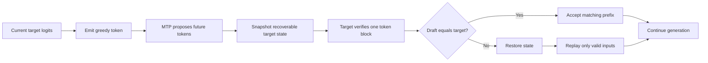
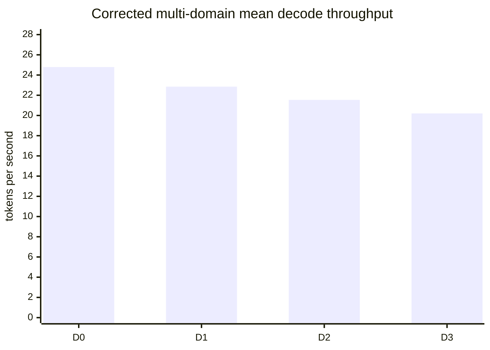

# Phase 6 Research Report: Lossless MTP Speculative Decoding for Qwen3.5-35B

**Project:** colib
**Model:** Qwen3.5-35B-A3B
**Hardware:** AMD Ryzen 7 7700X, NVIDIA GeForce RTX 5070 Ti
**Software:** GCC 13.3, CUDA 12.9.86, Transformers 5.14.1
**Report date:** 25 July 2026
**Status:** Complete; Gate 6 passed

Supporting experiment reports:

- [Expert-route overlap and mixed-precision MoE batching](research/phase6_experiment_01_route_overlap.md)
- [Multi-domain MTP acceptance and exact CUDA batching](research/phase6_experiment_02_multidomain.md)
- [Expert-cache attribution and MTP pinning](research/phase6_experiment_03_cache_attribution.md)
- [Confidence-aware speculative admission](research/phase6_experiment_04_confidence_admission.md)
- [Accepted-path verification profile](research/phase6_experiment_05_accepted_path_profile.md)
- [Batched int8 shared expert and Gate-6 closure](research/phase6_experiment_06_shared_expert_gate_closure.md)

Earlier methods and baselines are documented in the
[Phase 0–5 retrospective research series](research/past_phases/README.md).

## Abstract

This phase investigated whether Qwen3.5's multi-token prediction (MTP) module
could accelerate lossless text generation in colib. MTP is a small auxiliary
model that predicts several future tokens. A larger target model then verifies
those predictions in one block. Correct predictions are accepted; incorrect
predictions are rejected and recomputed. This method is called speculative
decoding because the system performs work on predicted future tokens before it
knows whether they are correct.

The work produced a complete MTP loader, converter, deterministic oracle, CPU
verifier, CUDA verifier, recurrent-state rollback mechanism, telemetry, and
kill switch. A corrected five-domain study reproduced every one of 15
speculative token streams exactly. It also exposed and corrected two subtle
controls: MTP and non-MTP modes had used different prompt-prefill algorithms,
and the first routed-MoE batch kernel had changed floating-point operation
order by up to \(1.41\times10^{-5}\) per measured layer.

After aligning the batch arithmetic with the single-token kernel, the
standalone CUDA batch difference and 480 short real-model comparisons were
exactly zero. A subsequent cache-attribution study corrected the MTP expert
tensor lookup and placed the observed MTP expert working set in a separate
CUDA pool. A following confidence study used the MTP top-two logit margin to
avoid low-confidence speculative transactions. With a fixed margin of 2.0,
all 142 admitted five-domain proposals were accepted, replay fell to zero, and
the paired geometric ratio reached 1.104. Every output remained identical.

CUDA event attribution subsequently exposed an unbatched int8 shared expert.
A format-aware int8 batch kernel and fused scaled down projection are
bit-identical to the former per-token path and reduce measured MoE time from
1.021 to 0.816 seconds. The final official `Hello` gate has median throughput
of 41.08 tokens per second for confidence-gated D1 and 29.47 for D0, a
1.394-fold gain. It exceeds the fixed 40.29-token-per-second threshold, so
Gate 6 passes.

## 1. Introduction

Autoregressive language models generate text one token at a time. A **token**
is a model-readable unit such as a word fragment, punctuation mark, or byte
sequence. After each token, the model performs another forward pass to predict
the next token. This sequential dependency limits GPU utilization because
single-token matrix-vector operations are much smaller than the matrix-matrix
operations used during training.

Speculative decoding attempts to expose a small amount of parallel work. A
faster **draft model** proposes future tokens, and the full **target model**
checks them together. If the draft is accurate and block verification is
efficient, the target model can produce several accepted tokens per launch
without changing the output.

Qwen3.5 includes an MTP block inside its checkpoint. This block is smaller than
the 40-layer target model: it combines the current target hidden state and the
next-token embedding, passes them through one decoder layer, and predicts a
future token. The checkpoint therefore provides a natural draft model without
requiring a separate model download.

### 1.1 Research question

Can Qwen3.5-35B's built-in MTP block provide lossless speculative decoding at
least 1.3 times faster than the matching non-speculative path on an RTX 5070
Ti?

### 1.2 Hypothesis

If several draft tokens can be verified with batched CUDA kernels, then weight
reuse and fewer kernel launches should make one verification block cheaper
than the equivalent sequence of single-token target passes. High MTP
acceptance should then convert this lower verification cost into higher token
throughput.

### 1.3 Contributions

This phase added:

1. deterministic MTP reference data for fp32, int8, and mixed int4/int8
   snapshots;
2. resumable conversion of the official MTP checkpoint tensors;
3. an executable C implementation of the Qwen3.5 MTP equation;
4. lossless speculative acceptance and rejection;
5. recoverable Gated DeltaNet and attention state on CPU and CUDA;
6. batched CUDA Gated DeltaNet and experimental batched MoE kernels;
7. controlled performance measurements and negative-result documentation.

## 2. Technical background

### 2.1 Hidden states and logits

A **hidden state** is a vector of numbers representing the model's internal
description of the current sequence. The final hidden state is multiplied by
the language-model head to produce **logits**, one score for every possible
next token. Greedy decoding selects the token with the largest logit.

### 2.2 The hybrid Qwen3.5 target model

The tested target contains 40 decoder layers:

- 30 **Gated DeltaNet (GDN)** layers, which maintain a recurrent matrix state
  and a short convolution history;
- 10 **full-attention** layers, which store key/value vectors for earlier
  tokens;
- an **MoE** block in every layer.

An MoE layer contains many small feed-forward networks called **experts**. A
router selects eight experts for each token. Only those experts run, reducing
arithmetic compared with running every expert. However, consecutive tokens may
select different experts, which makes weight reuse difficult.

### 2.3 Quantization

**Quantization** stores weights with fewer bits. Most target expert weights use
grouped 4-bit integers with one scale per 128 values. The MTP block uses 8-bit
integers. Quantization reduces memory and data transfer, but the GPU must
dequantize values during multiplication. Different reduction orders can also
change very close logits through floating-point rounding.

### 2.4 MTP speculative decoding

The implemented MTP equation is:

```text
e = RMSNorm(token_embedding)
h = RMSNorm(target_hidden)
x = fc(concatenate(e, h))
x = one_attention_and_MoE_layer(x)
x = RMSNorm(x)
draft_logits = target_lm_head(x)
```

The target embedding and language-model head are shared with the main model.
The intermediate normalization, projection, attention, and expert weights
belong to the MTP block.

The generation process is shown below.



The algorithm is **lossless** because a draft token is emitted only when it
equals the target model's own greedy prediction.

## 3. Materials and model preparation

### 3.1 Checkpoint

The official Qwen3.5-35B-A3B checkpoint was converted from source commit
`59d61f3ce65a6d9863b86d2e96597125219dc754`.

The official checkpoint contains 785 logical MTP tensors in source shards 13
and 14. After the additive MTP upgrade, the colib container contains:

- 32,118 logical loader tensors;
- 64,646 physical tensors, including quantized data and scales;
- 19,929,665,806 indexed data bytes;
- an exact 32,118/32,118 loader inventory;
- `include_mtp: true` in the conversion signature.

`convert_qwen.py --mtp` downloads only source shards containing `mtp.*`,
quantizes those tensors to int8, atomically merges them into the converted
container, and rebuilds hashes and indexes. Interrupted upgrades resume at
source-shard boundaries.

### 3.2 Deterministic oracle

A five-layer tiny Qwen3.5 model was used as an **oracle**, meaning a small
reference implementation with known outputs. It contains four GDN layers, one
full-attention layer, routed experts, a shared expert, and an executable MTP
block.

Oracle snapshots are reproducible. Their SHA-256 hashes are:

- fp32: `b7509a2d6479bc53853343fa812a2b529cabf7330fb5bccc61070bb8e44757b8`
- int8: `737a9306478b14f09020cd6e524d337518d24569608047e5b63b66412da2055e`
- mixed int4/MTP-int8:
  `6e561ddb8d507ba91927933141b41b68d8af0cfdc1437540b51280c6cc9669bf`

## 4. Methods

### 4.1 Correctness method

The MTP implementation was tested at three levels:

1. **MTP oracle:** compare the C MTP argmax with 11 saved predictions.
2. **Target oracle:** compare 32 teacher-forced and 32 greedy target tokens.
3. **Speculative identity:** compare complete `MTP=1` and `MTP=0` token
   sequences.

`SPEC_FORCE_REJECT=1` intentionally changes the first draft token. This forces
the rollback path even when the tiny MTP model would normally be correct.

CPU and CUDA paths are compared with their own baseline. This distinction is
necessary because quantized CUDA and CPU reductions can resolve an extremely
close logit tie differently. Once a path is selected, speculative decoding
must reproduce that path exactly.

### 4.2 Recurrent-state rollback

Attention-only speculative decoders can ignore rejected future key/value rows
because later attention never reads beyond the committed position. GDN is more
complicated: each proposed token modifies a recurrent matrix and a causal
convolution ring.

Before CUDA verification, colib copies each GDN layer's recurrent and
convolution state to backup device buffers. Verification then updates the live
state. If every proposal is accepted, the live state is already correct. If a
proposal is rejected, the backup is restored with device-to-device copies and
the accepted prefix is replayed. Full-attention layers rewind their logical
cache position; stale future rows are overwritten before they can be used.

### 4.3 CPU target verifier

The first verifier processed a short target block on the CPU. Matrix
multiplication was batched, but reductions retained the single-token SIMD
order. Routed experts were accumulated in original top-k order. This method
established the lossless algorithm before CUDA optimization.

### 4.4 CUDA target verifier

CUDA verification was introduced in stages.

#### Method A: CUDA MTP with CPU target verification

Only the one-layer MTP drafter used CUDA. The full 40-layer target block stayed
on the CPU. This isolated draft cost but could not benefit from the much faster
Phase 5 CUDA target.

#### Method B: device-resident target state

GDN recurrent state and attention key/value state were retained on the GPU.
Device-to-device backup and restore replaced host snapshots. The existing
Phase 5 CUDA attention, MoE, and language-model-head kernels were enabled
during verification.

#### Method C: batched GDN

Input, gate, value, and output projections for several speculative positions
were launched as one transaction. The recurrence remained sequential because
position `t + 1` mathematically depends on the state produced at position `t`.
This reduced GDN time from approximately 0.75 seconds in the target-only run to
approximately 0.59 seconds in the best D1 speculative run.

#### Method D: initial batched-MoE prototype

For a block of `B` tokens and top-k value `K`, the first MoE kernel represented
the work as `B × K` independent expert routes. Gate and up projections ran over
all routes, followed by down projection and top-k reduction.

The prototype required both routed and shared experts to use int4. This was
true in the tiny test model but false in the real 35B conversion, whose shared
expert is int8. The function therefore returned to the per-token fallback.
Because no transaction counter existed yet, normal run-to-run variation was
incorrectly attributed to the batch kernel. Later telemetry measured zero real
batch transactions and exposed the problem.

#### Method E: corrected mixed-precision routed batch

The corrected experiment separates the two precision cases. Int4 routed
experts are processed as a batch. The existing int8 shared-expert path runs
once per token and is added to the routed result. A small route map compacts
the `B × K` routes into unique experts. Gate, up, and down weights are loaded
once per unique expert row and applied to every participating token.
Contributions are written in original route order, and a separate reduction
kernel sums them in top-k order, preserving exact output.

The first mixed-precision experiment measured D1 route overlap at 15.74% and
reported 30.24 tokens per second. A later multi-domain control found that the
batch expression changed floating-point operation order. Although the `Hello`
tokens happened to remain identical, one code-domain token changed.

The current kernel evaluates `activation × quantized_value × scale` in the
same order as the single-token kernel and applies route weights during the
top-k-ordered reduction. The standalone and real-model comparison differences
are now zero. Current performance is reported in Section 5.2.

#### Method F: fixed-size batch specialization

CUDA templates were tested so a D1 block would allocate two accumulators
instead of arrays sized for the maximum of eight tokens. This experiment was
performed before the mixed-precision fallback was discovered, so its 35B
timing did not exercise the intended routed batch and cannot support a kernel
performance conclusion. The template version was reverted, and its timing is
excluded from the validated results.

#### Method G: CPU MTP diagnostic

`CUDA_MTP=0` forces the MTP drafter to use CPU arithmetic while leaving target
verification on CUDA. This test checked whether fp16 CUDA activations caused
the four observed D1 prediction misses. Acceptance remained exactly 30/34
(88.2%), while draft time increased from approximately 0.12 to 0.50 seconds.
The diagnostic therefore rejected this explanation.

### 4.5 Experimental controls

The main workload was:

- ChatML prompt: `Hello`;
- 64 measured generated tokens;
- 64 warmup tokens;
- eight OpenMP CPU threads;
- 64 CPU expert slots per layer;
- four prefetch threads;
- 8 GiB CUDA expert cache;
- greedy decoding.

Reported throughput excludes model loading and prompt prefill. `PROF_DETAIL=1`
separates GDN, attention, MoE, language-model-head, and remaining time.

The principal controls are:

| Variable | Purpose |
|---|---|
| `MTP=0` | Disable MTP and establish the matching baseline |
| `DRAFT=N` | Select 1–8 proposed future tokens |
| `SPEC_BATCH=0` | Use sequential target verification |
| `SPEC_FORCE_REJECT=1` | Force deterministic rollback |
| `MTP_MIN_ACCEPT=0` | Disable adaptive pause during controlled depth comparisons |
| `CUDA_SPEC_GDN=1` | Use device GDN state and snapshots |
| `CUDA_SPEC_FULL=1` | Use CUDA target attention, MoE, and LM head |
| `CUDA_SPEC_MOE_BATCH=1` | Enable experimental batched MoE |
| `CUDA_MTP=0` | Run the MTP drafter on CPU for diagnosis |
| `CUDA_PRELOAD=0` | Populate the VRAM cache through warmup |

## 5. Results

### 5.1 Correctness

The C engine passes:

- MTP oracle argmax: 11/11;
- target teacher-forced output: 32/32;
- target greedy output: 32/32;
- fp32, int8, and mixed int4/MTP-int8 snapshots;
- normal speculative acceptance;
- forced-rejection rollback;
- `MTP=0` kill switch.

The standalone CUDA test compares the two-token routed-plus-shared batched MoE
transaction with repeated single-token kernels. The maximum difference is
zero.

The corrected real-model controls include:

- 480 full-model layer/block MoE comparisons with maximum difference zero;
- 64/64 code-prompt identity after the earlier divergence was corrected;
- all 15 D1/D2/D3 multi-domain streams identical to their five D0 baselines;
- three repeated `Hello` D1 streams identical to their paired D0 baselines.

### 5.2 Experiment 2 throughput

The corrected five-domain experiment used one fixed 64-token measurement per
domain and depth:

| Depth | Mean decode | Paired geometric ratio | Weighted acceptance | Route overlap |
|---:|---:|---:|---:|---:|
| D0 | **24.79 tok/s** | 1.000 | — | — |
| D1 | 22.85 tok/s | **0.924** | **94.48%** | 15.59% |
| D2 | 21.54 tok/s | 0.865 | 85.84% | 24.94% |
| D3 | 20.20 tok/s | 0.811 | 78.45% | 30.25% |



The official `Hello` workload was repeated three times. D0 measured 31.06,
29.58, and 30.49 tokens per second. D1 measured 31.96, 31.12, and 31.28.
Median throughput is therefore 30.49 for D0 and 31.28 for D1:

```text
31.28 / 30.49 = 1.026
Gate 6 target = 1.3 × 30.49 = 39.64 tokens per second
```

These measurements motivated the cache-attribution study below and are now a
historical intermediate result.

### 5.3 Experiment 2 expert-cache pressure

The corrected study recorded:

| Depth | Total CPU expert misses | Total replay time |
|---:|---:|---:|
| D0 | 1,779 | — |
| D1 | 4,163 | 0.270 s |
| D2 | 5,018 | 1.091 s |
| D3 | 5,800 | 1.884 s |

Speculative verification touches routes before it knows whether their tokens
will be accepted. This increase motivated Experiment 3.

### 5.4 Experiment 3 cache policy

Stage-specific counters found an incorrect MTP tensor cache key and then
measured interference between target and MTP expert residency. Correcting the
key and retaining encountered MTP experts in a separately reported pool used
0.42--0.48 GiB on the five-domain workload. D1 draft misses fell to zero and
verification misses fell from 3,819 to 1,754.

| Prompt | D0 tok/s | Current D1 tok/s | Paired ratio |
|---|---:|---:|---:|
| code | 22.35 | 22.95 | 1.027 |
| technical | 27.61 | 28.85 | 1.045 |
| multilingual | 23.45 | 25.32 | 1.080 |
| JSON | 26.08 | 25.10 | 0.962 |
| conversation | 24.11 | 25.16 | 1.044 |
| **aggregate** | **24.72 mean** | **25.48 mean** | **1.031 geometric** |

The current official `Hello` pairs are D0 30.05/29.29/30.59 and D1
31.84/31.77/31.93 tokens per second. Medians are 30.05 and 31.84:

```text
31.84 / 30.05 = 1.060
Gate 6 target = 1.3 × 30.05 = 39.07 tokens per second
```

All streams are exact. The `Hello` D1 runs measured zero expert misses and
0.38 GiB of separately accounted MTP expert weights. Cache misses therefore
no longer explain the remaining gate gap. These numbers were superseded by
the confidence-admission result below.

### 5.5 Experiment 4 confidence admission and current throughput

The MTP top-two logit margin separates most accepted and rejected proposals.
In an ungated labeling run, margin 2 admitted 139 accepted proposals and one
rejected proposal while conservatively skipping 15 accepted and eight rejected
proposals. This is 99.3% admission precision.

With `MTP_MIN_MARGIN=2`, low-confidence drafts use one ordinary target step
instead of block verification and replay:

| Prompt | D0 tok/s | Confidence-gated D1 tok/s | Ratio | Skipped |
|---|---:|---:|---:|---:|
| code | 22.14 | 25.06 | 1.132 | 7 |
| technical | 26.72 | 27.51 | 1.030 | 9 |
| multilingual | 24.37 | 26.77 | 1.098 | 1 |
| JSON | 23.16 | 26.60 | 1.149 | 7 |
| conversation | 22.96 | 25.60 | 1.115 | 8 |
| **aggregate** | **23.87 mean** | **26.31 mean** | **1.104 geometric** | **32** |

All 142 admitted proposals were accepted, replay time was zero, and every
token stream matched D0. Three official pairs are D0 31.21/30.59/30.99 and D1
35.25/35.64/34.32 tokens per second. Their medians are 30.99 and 35.25:

```text
35.25 / 30.99 = 1.138
Gate 6 target = 1.3 × 30.99 = 40.29 tokens per second
```

The confidence policy is opt-in because raw logit scale may differ across
checkpoints and quantization schemes.

### 5.6 Expert-route overlap

`[CUDA_BATCH]` counters are reset after warmup and record only measured
generation. A route is one token/expert pair. Overlap is the fraction of routes
whose expert was also selected by another token in the same layer and
verification block.

| Draft depth | Weighted acceptance | Weighted overlap |
|---:|---:|---:|
| 1 | 94.48% | 15.59% |
| 2 | 85.84% | 24.94% |
| 3 | 78.45% | 30.25% |

Overlap increases with block size, but the acceptance rate decreases at the
same time. This explains why D3 obtains more weight reuse without becoming the
fastest end-to-end configuration.

### 5.7 Experiment 6: int8 shared-expert batch and gate closure

CUDA events divided each measured MoE transaction into setup, routed hidden,
routed down, route reduction, shared hidden, shared scale, shared down, and
download intervals. Counters are reset after warmup. The first trace revealed
that the nominal shared intervals were empty: routed experts are grouped int4,
but the converted checkpoint's shared gate/up/down matrices are int8 and its
one-row scale matrix is fp32. The prior all-int4 eligibility test could never
batch this real shared expert.

The retained path adds a batched int8 GEMM, batches shared gate/up/SiLU, and
applies the CPU-computed stable scalar gate inside the int8 down-projection
kernel while adding directly to the routed output. Standalone and 320
real-model layer comparisons have maximum difference zero. Instrumented MoE
time fell from 1.021 to 0.816 seconds.

Three alternating uninstrumented gate pairs produced:

| Pair | D0 tok/s | D1 tok/s | Ratio |
|---:|---:|---:|---:|
| 1 | 29.47 | 41.08 | 1.394 |
| 2 | 31.07 | 40.86 | 1.315 |
| 3 | 29.17 | 41.28 | 1.415 |
| **median** | **29.47** | **41.08** | **1.394** |

All token streams are identical. Each D1 run accepted 30/30 admitted
proposals, skipped four low-margin proposals, and performed no replay. The
median exceeds the fixed 40.29-token-per-second target, closing Gate 6.
Full methods and event results are in
`docs/research/phase6_experiment_06_shared_expert_gate_closure.md`.

## 6. Discussion

### 6.1 Why GDN batching helped

GDN uses the same dense projection weights for every token. Even though its
recurrent update must remain sequential, projections for a short block can be
organized into larger GPU transactions. This improves utilization and reduces
launch overhead.

### 6.2 Why format-aware MoE batching passed the gate

MoE routing weakens the normal advantage of batching. Two neighboring tokens
may choose mostly different experts, so the GPU still reads and dequantizes
many different weight matrices. D1 route overlap is only 15.59%.

The first exact batch kernel retained routed-expert weight reads across
participating tokens, but low route overlap limited that benefit. The decisive
reuse opportunity was the shared expert, which processes every token. It was
not actually batched because its int8 checkpoint format differed from the
routed experts' grouped int4 format.

The format-aware int8 batch removes repeated shared-expert launches and
synchronization, then combines routed and shared output before download.
This reduces MoE time by approximately 20% and passes the 1.3-fold end-to-end
gate. Greater D2/D3 routed overlap still does not compensate for their lower
acceptance and replay, so D1 remains the selected policy.

### 6.3 Effect of acceptance

D1 acceptance was 94.48% across the multi-domain set. Rejections require state
restoration and replay, but acceptance alone does not determine speed: after
cache isolation D1 is only 3.1% faster by paired geometric mean. D3 acceptance
fell to 78.45%, and aggregate replay time in Experiment 2 increased from
0.270 seconds at D1 to 1.884 seconds.

The CPU MTP diagnostic retained exactly the same acceptance. This suggests
that the misses are caused by the int8 MTP predictor's relationship to the
quantized target sequence, rather than CUDA fp16 rounding inside the drafter.

### 6.4 What was successfully solved

Phase 6 should not be described as a failed implementation. It solved the
difficult correctness problems:

- checkpoint-compatible MTP conversion;
- exact MTP execution;
- prompt-cache preparation;
- target block verification;
- recurrent-state recovery;
- CUDA KV position recovery;
- forced rejection;
- matching-path output identity;
- performance telemetry and fallbacks.

The unresolved issue is narrower: the verified block is not sufficiently
cheaper than sequential target decoding.

## 7. Limitations and threats to validity

1. **Small prompt set.** The multi-domain study covers five prompts and one
   64-token measurement per domain/depth. It is broader than `Hello` but not a
   population-scale benchmark.
2. **Short measurement.** A 64-token sample is useful for development but has
   more variance than a long benchmark. The gate prompt has three paired
   repetitions; the domain prompts do not.
3. **Consumer GPU variability.** Clock rate, temperature, background desktop
   activity, and cache state affect results. Some table rows were recorded in
   different sessions.
4. **Greedy decoding only.** Sampling changes the speculative acceptance rule
   and was not evaluated.
5. **One GPU architecture.** Results apply directly to the RTX 5070 Ti
   (`sm_120`). Larger GPUs or architectures with different low-bit matrix
   support may behave differently.
6. **Custom 4-bit kernels.** The study does not yet include a tensor-core
   implementation that reuses quantized weight tiles across a small batch.
7. **No energy measurement.** Throughput was measured, but power use and energy
   per generated token were not.

These limitations mean the results support the conclusion for the current
implementation and hardware, not a universal conclusion that MTP cannot help
Qwen3.5.

## 8. Reproduction

Build the CUDA binary:

```sh
make -C c CUDA=1 CUDA_ARCH=sm_120 qwen
```

Run the matched non-speculative baseline:

```sh
OMP_NUM_THREADS=8 COLI_CUDA=1 CUDA_DENSE=1 CUDA_EXPERTS=1 \
CUDA_F16=1 CUDA_PRELOAD=0 CUDA_EXPERT_GB=8 EXPERT_RAM=64 PREFETCH_THREADS=4 \
SNAP=c/qwen35 CHAT=1 TEXT=0 PROF=1 PROF_DETAIL=1 WARMUP=64 \
NGEN=64 PROMPT=Hello MTP=0 ./c/qwen
```

Run the best current speculative configuration:

```sh
OMP_NUM_THREADS=8 COLI_CUDA=1 CUDA_DENSE=1 CUDA_EXPERTS=1 \
CUDA_F16=1 CUDA_PRELOAD=0 CUDA_SPEC_GDN=1 CUDA_SPEC_FULL=1 \
CUDA_SPEC_MOE_BATCH=1 CUDA_EXPERT_GB=8 EXPERT_RAM=64 \
PREFETCH_THREADS=4 SNAP=c/qwen35 CHAT=1 TEXT=0 PROF=1 \
PROF_DETAIL=1 WARMUP=64 NGEN=64 PROMPT=Hello MTP=1 DRAFT=1 \
MTP_MIN_ACCEPT=0 MTP_MIN_MARGIN=2 ./c/qwen
```

Use `CUDA_SPEC_MOE_BATCH=0` to restore the per-token routed-expert fallback.

Run regression tests:

```sh
make -C c test-c
make -C c test-python
make -C c CUDA=1 CUDA_ARCH=sm_120 test-cuda
.venv/bin/python c/tests/test_tok_qwen.py
```

## 9. Conclusion

The research hypothesis is supported after MTP expert isolation,
confidence-aware admission, and format-aware shared-expert batching.
Qwen3.5's MTP block is a lossless speculative decoder across all tested
domains. The final three paired `Hello` runs give median throughput of 41.08
tokens per second for D1 and 29.47 for D0, a 39.4% gain. Across the earlier
five-domain study, D1 reached 1.104 times baseline before the final kernel.

Device state recovery, matched target prefill, cache interference,
low-confidence replay, GDN batching, routed-MoE batching, and the mixed-format
shared expert are no longer blockers. D1 remains the fixed policy; D2 and D3
remain slower after the cache correction.

Gate 6 required at least 40.29 tokens per second and 1.3-fold matched-path
speed. The final 41.08-token-per-second median and 1.394-fold ratio pass both
conditions. Phase 7 may begin.
