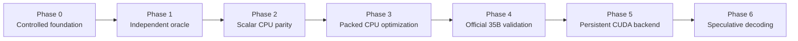

# Retrospective Research Papers: Phases 0–5

This folder reconstructs the completed colib phases as a connected
undergraduate-level research series. The papers distinguish measurements made
at the time from later interpretation. They do not silently promote synthetic
benchmarks into real-model results or diagnostic comparisons into gate
criteria.

## Study sequence

The phases form an evidence ladder:

1. control the build and file-loading environment;
2. define expected model behavior independently;
3. reproduce that behavior in a simple implementation;
4. optimize while retaining the reference;
5. test the real checkpoint against an external implementation;
6. move state and computation to the GPU without discarding the controls.

## Papers

| Phase | Paper | Principal result |
|---|---|---|
| 0 | [Reproducible inference foundation](phase0_reproducible_foundation.md) | 8/8 infrastructure tests and a clean warning-enabled build |
| 1 | [Independent oracle and tokenizer](phase1_oracle_and_tokenizer.md) | Reproducible tiny snapshots and 10,000/10,000 exact tokenizer cases |
| 2 | [CPU numerical correctness](phase2_cpu_correctness.md) | 32/32 teacher-forced and greedy tokens in all three modes; worst activation error \(8.94\times10^{-8}\) |
| 3 | [Exact CPU optimization](phase3_cpu_optimization.md) | Packed kernels retained parity; 40.34 GB/s isolated int4 GEMV |
| 4 | [Full-model conversion and validation](phase4_full_model_validation.md) | 19.09 GB container, 96.171875% teacher-forced agreement, 1.6145% PPL delta |
| 5 | [Persistent CUDA acceleration](phase5_cuda_acceleration.md) | 31.75 tok/s median warm decode, 3.40× the recorded CPU baseline |

The active Phase 6 paper is maintained separately at
[Lossless MTP speculative decoding](../../phase6_mtp.md), with focused
experiments in the parent research folder.

## How to read the results

Terms that recur across the series:

- **Oracle:** an independent reference implementation used to define expected
  outputs.
- **Teacher forcing:** providing the same known previous tokens to both
  implementations, so each next-token comparison has the same context.
- **Greedy decoding:** choosing the highest-scoring next token.
- **Quantization:** storing weights with low-bit integers and scales to reduce
  memory use.
- **Parity:** agreement with the chosen reference under a stated tolerance.
  It does not mean that all implementations are bit-identical.
- **Gate:** a predeclared condition that must pass before the project proceeds
  to a more complex phase.

Synthetic results are labelled synthetic. Warm decode excludes model load and
prompt prefill. The Phase 4 validation is a comparison with another quantized
runtime because the official approximately 70 GB BF16 model could not fit in
the available 32 GB host memory.
