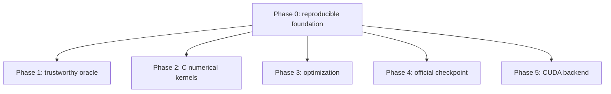

# Phase 0 Research Report: Building a Reproducible Inference Foundation

**Project:** colib
**Study type:** Engineering-methods study
**Report date:** 24 July 2026
**Retrospective status:** Gate completed on 20 July 2026

## Abstract

Phase 0 asked whether the reusable parts of the earlier colibri C inference
project could be separated from its model-specific assumptions and used as the
foundation of a new Qwen3.5 runtime. The work established a licensed repository,
portable support headers, a repeatable test command, hardware preflight checks,
and a minimal Qwen executable that could parse configuration, load a tokenizer,
resolve tensor names, and traverse a no-op inference path.

The phase passed eight of eight C tests and compiled cleanly with GCC warning
checks. It did not claim numerical model correctness or useful generation:
those outcomes deliberately belonged to later gates. The main result was a
controlled experimental base in which subsequent failures could be attributed
to model work rather than missing build, file, or test infrastructure.

## 1. Research question

Can a small, auditable subset of colibri's infrastructure support a fresh
Qwen3.5 implementation without importing colibri's GLM/OmoLM model logic?

The distinction matters because an inference runtime has two broad parts:

- **infrastructure**, such as memory mapping, tensor-file reading, tokenization
  helpers, tests, and timing; and
- **model semantics**, the equations and tensor layout specific to one neural
  network.

Reusing the first category reduces duplicated engineering. Reusing the second
without proof can silently produce plausible but incorrect output.

## 2. Method

The repository was initialized with an Apache 2.0 license and a NOTICE file
crediting the reused colibri material. Generic headers, the I/O benchmark, and
tests were vendored selectively. Qwen execution began in a new `qwen.c`
translation unit rather than by renaming an existing model implementation.

The initial executable implemented the following sequence:


A **tensor** is a multidimensional numerical array. A **tensor inventory** is
the list of arrays a checkpoint contains, including each name, shape, and data
type. The no-op traversal verified plumbing while intentionally postponing the
real layer equations.

Configuration parsing accepted Qwen's nested `text_config`, RoPE settings in
both expected layouts, explicit layer types, and the full-attention interval.
Tensor lookup tolerated known checkpoint prefixes. A preflight script checked
disk space, available memory, CUDA version requirements, and storage
throughput before large model downloads were attempted.

The phase gate required:

1. all generic C tests to pass;
2. clean compilation under the selected warning flags;
3. an auditable boundary between reused infrastructure and new model code; and
4. no assertion that the skeleton performed a correct Qwen forward pass.

## 3. Results

`make test-c` passed 8/8 tests. The C target compiled cleanly with
`-Wall -Wextra`. Repository licensing and provenance records were present. The
Qwen skeleton could parse the planned metadata and exercise its loader path on
synthetic inputs.

The result can be represented as a dependency graph:



Every later phase used the build, testing, configuration, and tensor-loading
conventions established here.

## 4. Interpretation

Phase 0 reduced **experimental confounding**. A confound is an uncontrolled
factor that offers a competing explanation for a result. For example, if a
new attention kernel and a new tensor reader were introduced together, an
incorrect token could come from either component. Establishing the reader and
test harness first made later numerical comparisons more informative.

The deliberate no-op forward was also useful. It separated “the program can
find and load the model” from “the program computes the model correctly.”
These are independent claims and require different evidence.

## 5. Limitations

The skeleton was not tested against the full official checkpoint during this
phase. Eight infrastructure tests are not a measure of language-model
correctness. The study also did not compare alternative build systems,
compilers, operating systems, or licenses. Results therefore support the
chosen development environment, not universal portability.

## 6. Reproducibility

The historical gate was evaluated with:

```bash
make test-c
make qwen
```

Hardware preflight and I/O benchmark commands were recorded in the project
README and Makefile. Later phases expanded the test count; the 8/8 figure here
is retained because it is the result at the Phase 0 gate.

## 7. Conclusion

Phase 0 produced a reproducible and legally documented base for Qwen3.5
research. Its scientific value was not a novel algorithm but the isolation of
variables: model equations, quantization, and acceleration could subsequently
be introduced one gate at a time.
