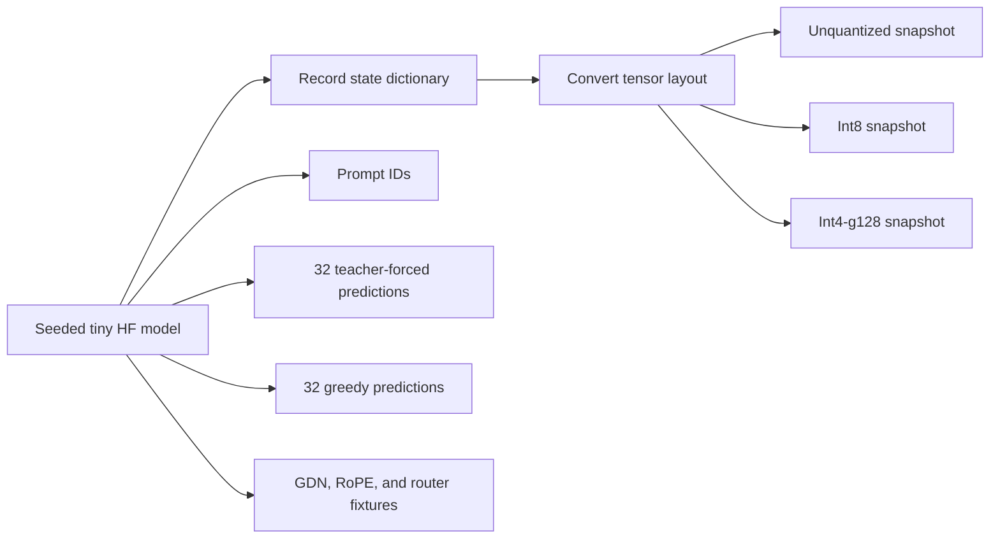

# Phase 1 Research Report: Establishing an Independent Qwen3.5 Oracle

**Project:** colib
**Reference software:** Transformers 5.14.1
**Report date:** 24 July 2026
**Retrospective status:** Gate completed

## Abstract

Phase 1 constructed an independent reference, or **oracle**, for the Qwen3.5
architecture before implementing its numerical kernels in C. The study used a
deterministic five-layer text model containing four Gated DeltaNet layers and
one full-attention layer. It emitted full-precision, int8, and grouped-int4
snapshots; token predictions; intermediate fixtures; a complete state-dictionary
inventory; and synthetic multi-token-prediction tensors with checkpoint-compatible
names.

Architecture details were checked against Transformers 5.14.1 and the official
checkpoint index. The official checkpoint uses separate DeltaNet projection
tensors, so no speculative fused-projection conversion was needed. A
10,000-case multilingual tokenizer study achieved exact token-ID parity after
the C tokenizer was corrected for Unicode normalization, combining marks,
single-digit behavior, and special tokens. The resulting oracle supplied a
fixed experimental target for Phase 2.

## 1. Research question

Can the expected inputs, tensor names, intermediate calculations, and token
outputs of Qwen3.5 be recorded precisely enough that a separate C
implementation can be tested without relying on visual inspection of generated
text?

Generated prose is a weak correctness test. A broken model can still emit
words, and two correct implementations can diverge after one nearly tied
choice. A useful oracle must instead expose small, deterministic comparisons.

## 2. Technical background

A **tokenizer** maps text to integer token IDs. The model consumes IDs rather
than characters. Exact tokenizer agreement is therefore a prerequisite for
model agreement.

Qwen3.5 is a **hybrid model**: some layers use full attention, while others use
Gated DeltaNet (GDN), a recurrent mechanism. Full attention compares a token
with stored representations of earlier tokens. GDN updates a compact matrix
state instead.

**RoPE**, or rotary positional embedding, rotates selected query and key
components according to token position. **Partial RoPE** means only part of
each attention head is rotated.

An **expert router** assigns each token to a small subset of feed-forward
networks. Qwen3.5 also has a shared expert that runs for every token.

## 3. Method

The Python environment was fixed to Transformers 5.14.1. A seeded tiny model
was generated twice for each storage mode:

- BF16-compatible unquantized weights;
- row-scaled int8 weights;
- grouped int4 weights with one scale per 128 values.

**Quantization** represents model weights with low-bit integers plus scale
values. It saves memory but introduces rounding. The shared quantization
implementation lived in `convert_qwen.py` so oracle generation, unit tests, and
later full-model conversion could not drift into three different definitions.

The oracle pipeline was:

**Teacher forcing** feeds the known correct previous token at each step. It
localizes an error to one position because an early mistake is not allowed to
change all later inputs. **Greedy generation** feeds back the model's own
highest-scoring token and tests the complete generation loop.

The checkpoint index and Transformers source were examined to settle open
questions. The recorded architecture includes:

- zero-centred RMS normalization using `1 + weight`;
- a plain gated RMS normalization inside GDN;
- separate `in_proj_qkv`, `in_proj_z`, `in_proj_b`, and `in_proj_a` tensors;
- a causal convolution over Q, K, and V followed by SiLU;
- a query projection containing both query and gate values;
- query/key normalization before partial split-half RoPE;
- router probabilities computed with fp32 softmax, top-k selection, and
  unconditional renormalization;
- checkpoint-fused expert arrays converted into individual expert tensors.

The multi-token-prediction (MTP) section was represented by correctly named
synthetic tensors. Its numerical study was explicitly deferred to Phase 6.

For tokenizer testing, 10,000 deterministic cases covered source code,
multiple writing systems, Chinese/Japanese/Korean text, emoji, whitespace,
escaped controls, combining marks, and special tokens. Official tokenizer IDs
were compared directly with the C tokenizer IDs.

## 4. Results

All generated artifacts were byte-identical across repeated runs with the same
seed. The loader accepted the full-precision tiny snapshot and completed its
intended no-op forward path. Tensor names and dimensions matched the documented
loader map.

Tokenizer comparison reached 10,000/10,000 exact cases. Corrections required
by the comparison included NFC-related Unicode handling, mark classification,
one-digit splitting, and special-token recognition.

The official checkpoint index confirmed split DeltaNet projections. This
closed the earlier possibility that the converter would need to split a fused
matrix based on an inferred ordering.

## 5. Interpretation

The most important result was **observability**. Instead of asking only whether
the final text looked right, later work could ask:

- Did the tokenizer produce the same IDs?
- Did partial RoPE rotate the same elements?
- Did the router select the same experts?
- Did teacher-forced predictions match at every position?

This turns model implementation into a sequence of falsifiable tests. It also
reduces circular validation: the C code is compared with an independent Python
implementation rather than with another path through the same C functions.

## 6. Limitations

The oracle is deliberately tiny and randomly initialized; it measures equation
parity, not useful language ability. The synthetic MTP tensors reproduce
checkpoint structure but not Phase 6 MTP behavior. Text-only RoPE does not
exercise multimodal position IDs. Finally, matching one pinned Transformers
version does not prove compatibility with future upstream changes.

## 7. Conclusion

Phase 1 established deterministic architecture and tokenizer references before
C kernel development. Exact tokenizer parity and settled checkpoint naming
removed two common sources of ambiguous downstream failures. Gate 1 therefore
provided the measurement instrument required for numerical implementation.
