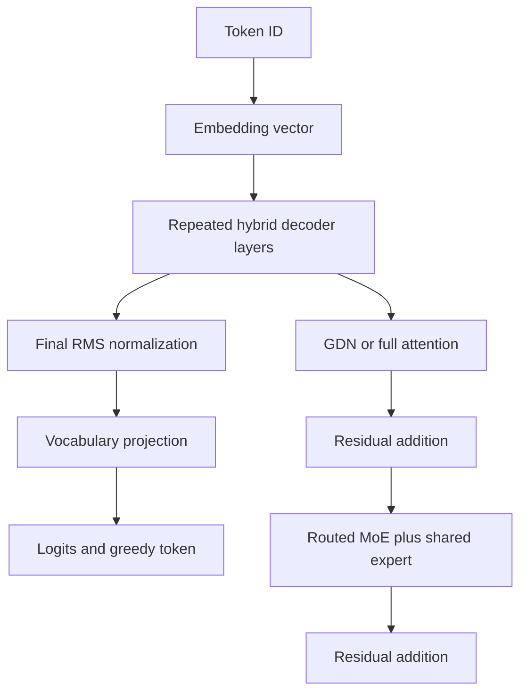
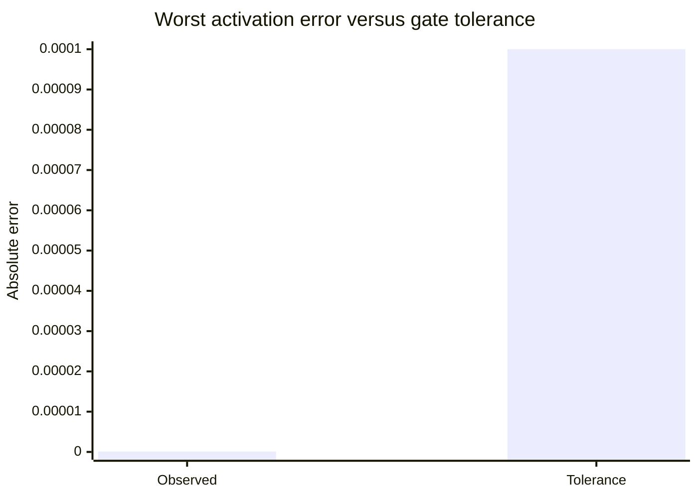

# Phase 2 Research Report: Numerical Parity of a CPU Qwen3.5 Forward Pass

**Project:** colib
**Implementation:** C, scalar/fp32 reference path
**Report date:** 24 July 2026
**Retrospective status:** Gate completed

## Abstract

Phase 2 implemented the complete text-only Qwen3.5 forward pass in C and tested
it against the deterministic Phase 1 oracle. The implementation included
Gated DeltaNet recurrence and convolution, full gated grouped-query attention,
partial RoPE, mixture-of-experts routing, routed and shared SwiGLU experts,
residual connections, normalization, and the complete tensor loader map.

All three tiny storage modes—unquantized, int8, and grouped int4—matched 32
teacher-forced and 32 greedy token predictions. Comparison of 185 saved
layer-token activation states per mode remained within an absolute tolerance
of \(10^{-4}\); the worst observed difference was \(8.94\times10^{-8}\).
Eleven C tests and five Python tests passed. These results established a
correct scalar baseline before architecture-specific optimization.

## 1. Research question

Can a from-scratch C implementation reproduce the reference Qwen3.5
calculation, layer by layer and token by token, across the planned storage
formats?

Phase 1 defined expected behavior. Phase 2 tested the stronger claim that the
complete runtime—not only isolated fixtures—implemented the same computation.

## 2. Model components

The forward pass transforms a token ID into scores for the next token:

A **residual connection** adds a layer's input to its output. It allows a deep
network to modify rather than completely replace the current representation.

**Grouped-query attention (GQA)** uses more query heads than key/value heads.
Several query heads share one key/value head, reducing stored state.

**SwiGLU** is a feed-forward function with two input branches. One branch is
passed through the SiLU activation and multiplied elementwise by the other
before an output projection.

## 3. Method

The C implementation first used fp32 arithmetic and simple loops. This
reference-oriented choice prioritized traceability over speed. The following
components were implemented:

1. causal convolution history as a ring buffer;
2. exact GDN recurrent-state updates;
3. GDN gated RMS normalization;
4. query/key normalization and partial split-half RoPE;
5. causal gated GQA with a key/value cache;
6. fp32 router softmax, top-k selection, and weight normalization;
7. routed experts and the always-active shared expert;
8. hybrid layer selection and both residual paths.

A **ring buffer** is a fixed-size array whose write position wraps to the
beginning. It stores only the recent convolution inputs rather than moving the
whole history for every token.

A **key/value cache** stores attention representations from earlier tokens so
they do not have to be recomputed.

For low-bit snapshots, weights were initially dequantized eagerly into fp32.
This tested quantized file interpretation without yet mixing correctness work
with optimized integer dot products.

Correctness was evaluated at three levels:

- focused fixtures for GDN, RoPE, and routing;
- 185 intermediate activation states across layers and tokens;
- final token IDs for 32 teacher-forced and 32 greedy steps.

Intermediate activations were compared with absolute error

\[
e_{\max} = \max_i |c_i-r_i|,
\]

where \(c_i\) is a C value and \(r_i\) is the oracle value. The acceptance
threshold was \(10^{-4}\).

## 4. Results

The unquantized, int8, and grouped-int4 tiny snapshots each achieved:

- 32/32 teacher-forced token matches;
- 32/32 greedy token matches;
- 185 compared layer-token states within \(10^{-4}\).

The largest recorded activation difference was
\(8.94\times10^{-8}\), approximately one thousand times smaller than the
allowed threshold. Eleven C tests and five Python tests passed.

The chart uses a linear scale; consequently, the observed bar is nearly
invisible relative to the tolerance.

## 5. Interpretation

Matching final tokens alone would not have been sufficient. An argmax—the
index of the largest logit—can remain unchanged even when many internal values
are wrong. The activation comparison showed that the internal trajectory also
closely followed the oracle.

Testing teacher-forced and greedy modes served different purposes.
Teacher-forced parity localized individual calculations. Greedy parity tested
the closed feedback loop, including state updates and cache positions. Passing
both provided stronger evidence than either test by itself.

The eager-dequantization approach was intentionally temporary. It established
that container scales, group boundaries, tensor shapes, and data ordering were
correct before Phase 3 introduced packed integer kernels.

## 6. Limitations

The tiny model does not reproduce the memory pressure or numerical accumulation
length of the 35B checkpoint. Absolute agreement on random small weights cannot
prove that every rare real-model case is covered. The comparison also used a
fixed CPU floating-point environment and greedy decoding; sampling behavior was
outside the gate.

Performance was not a Phase 2 outcome. Scalar fp32 code was a correctness
control, not the intended deployment path.

## 7. Conclusion

Phase 2 converted the architecture specification into an executable C model
and demonstrated close numerical agreement at fixture, activation, and token
levels. This scalar implementation became the control condition for Phase 3
CPU optimization and later CUDA work.
