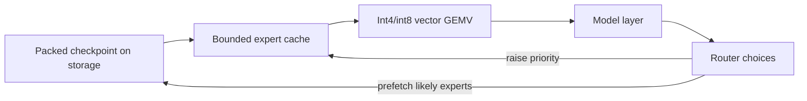
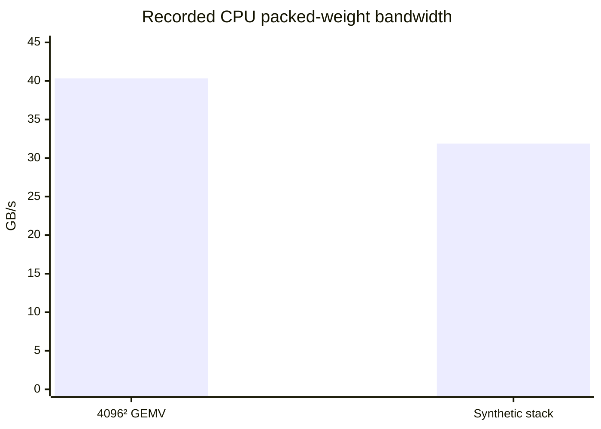

# Phase 3 Research Report: Exact CPU Optimization Under Memory Constraints

**Project:** colib
**Primary CPU:** AMD Ryzen 7 7700X
**Compiler:** GCC 13.3
**Report date:** 24 July 2026
**Retrospective status:** Gate completed

## Abstract

Phase 3 optimized the correct scalar Qwen3.5 implementation for CPU execution
without changing its oracle tokens. Packed int8 and grouped-int4 weights were
retained in memory and evaluated with AVX2/AVX-512 vector kernels. The work also
added chunked Gated DeltaNet prefill, OpenMP parallel regions, an optional
BF16 key/value cache, and a bounded least-frequently-recently-used expert cache
with asynchronous prefetch.

All oracle modes remained token-exact under stressed cache settings. Thirteen C
tests, five Python tests, and 10,000 tokenizer cases passed. On the Ryzen 7
7700X, a 4096-by-4096 grouped-int4 matrix-vector benchmark reached 40.34 GB/s.
A synthetic 40-layer, nine-active-expert stack reached 52.99 tokens per second
while reading 31.88 GB/s from 0.56 GiB of unique packed weights. These
microbenchmarks demonstrated an operational packed path; they did not predict
the final 35B model speed measured in Phase 4.

## 1. Research question

Can the Phase 2 implementation be accelerated using compressed weights,
parallel CPU execution, and bounded expert storage while preserving the exact
reference token sequence?

The central engineering constraint was memory traffic. During single-token
generation, each large matrix is multiplied by one vector. This
**matrix-vector multiplication (GEMV)** performs relatively little arithmetic
for every byte of weight data read, so memory bandwidth often limits speed.

## 2. Optimization methods

### 2.1 Packed integer weights

Int8 weights were stored as eight-bit integers with scales. Grouped-int4
weights stored two four-bit values per byte and one scale for each group of 128
values. Unlike the eager Phase 2 path, weights remained compressed until the
dot product.

AVX2 and AVX-512 are CPU instruction sets that operate on multiple values per
instruction. Optional VNNI integer dot-product instructions accelerated the
int8 expert path where available; a tested fallback remained available when
integer dot product was disabled.

### 2.2 Chunked recurrent prefill

**Prefill** processes the prompt before the first generated token. Performing
GDN recurrence one token at a time underuses the CPU. The implementation added
a 64-token chunked WY-style computation matching Transformers 5.14.1, while
retaining the sequential recurrence as a reference.

The tested boundary lengths were 1, 5, 63, 64, 65, and 127 tokens. These cases
exercise empty edges, partial chunks, an exact chunk, and multiple chunks.

### 2.3 Parallelism and bounded expert memory

OpenMP parallel work-sharing was applied to independent rows, heads, experts,
and prefill operations. A bounded expert cache loaded only a configured number
of expert tensors. It used a least-frequently-recently-used policy: frequently
or recently selected experts were less likely to be evicted. Asynchronous
prefetch attempted to load likely future experts before their computation.

An optional BF16 key/value cache reduced attention-state memory. BF16 is a
16-bit floating-point format with a wide numerical range but fewer precision
bits than fp32.

## 3. Experimental method

Correctness was treated as a constraint rather than a performance metric.
Every optimized oracle mode had to retain all teacher-forced and greedy token
IDs. Chunked GDN outputs were compared with the sequential implementation and
the independent Python fixture.

Cache stress used `EXPERT_RAM=2`, forcing frequent expert replacement rather
than allowing the complete tiny model to remain resident. Integer dot-product
fallback was tested by disabling the optional path.

Performance was measured with two synthetic workloads:

1. a 4096-by-4096 grouped-int4 GEMV, reported as effective bytes per second;
2. a 40-layer stack with nine active experts per layer, hidden size 2048 and
   expert intermediate size 512.

The synthetic stack contained 0.56 GiB of unique packed weights. Reported
bandwidth represents model-weight traffic divided by elapsed time.

## 4. Results

All optimized oracle modes remained exact at the token level. The chunked GDN
implementation agreed with the sequential path within \(1.2\times10^{-7}\)
for all tested sequence boundaries and with the independent reference fixture
within \(4.2\times10^{-5}\).

The complete regression set passed:

- 13 C tests;
- 5 Python tests;
- 10,000/10,000 tokenizer cases;
- a clean x86-64-v3 build.

Performance results were:

| Workload | Throughput | Effective bandwidth |
|---|---:|---:|
| 4096² grouped-int4 GEMV | not reported as tokens/s | 40.34 GB/s |
| Synthetic 40-layer expert stack | 52.99 tokens/s | 31.88 GB/s |

## 5. Interpretation

Packed execution attacked the principal resource cost directly: fewer weight
bytes had to cross the memory subsystem. The lower synthetic-stack bandwidth
than the isolated GEMV is expected because a full stack includes routing,
normalization, cache management, and smaller operations.

Chunked prefill and single-token decode optimize different shapes. Prefill can
reuse work across many prompt tokens; decode has an unavoidable sequential
dependency. Keeping both code paths allowed each regime to use an appropriate
algorithm while retaining the sequential method as a test control.

The cache stress result showed functional correctness under eviction, but did
not establish the ideal cache size for the official model. That question
depends on routing behavior, storage speed, and available RAM.

## 6. Limitations

Synthetic randomly generated weights generally remain in the operating-system
page cache and do not reproduce every storage stall of a 35B checkpoint.
The 52.99 token/s figure is therefore a kernel integration benchmark, not a
model forecast. Effective bandwidth is derived rather than a direct memory-bus
measurement. Results were obtained on one CPU and compiler configuration.

## 7. Conclusion

Phase 3 established a fast, bounded-memory CPU path while preserving the Phase
2 oracle. It supplied the packed tensor formats and cache behavior later used
to convert and execute the official checkpoint.
