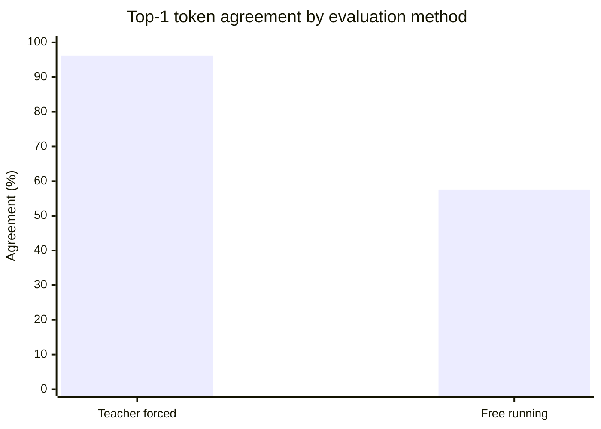

# Phase 4 Research Report: Streaming Conversion and Validation of Qwen3.5-35B

**Project:** colib
**Model:** Qwen3.5-35B-A3B
**Host:** AMD Ryzen 7 7700X, 32 GB RAM
**Report date:** 24 July 2026
**Retrospective status:** Gate completed with documented validation limits

## Abstract

Phase 4 scaled colib from a deterministic tiny model to the official
Qwen3.5-35B-A3B checkpoint. A streaming converter processed fourteen source
shards without requiring the approximately 70 GB BF16 checkpoint to coexist in
memory. The resulting indexed container held 31,333 logical tensors and 62,305
physical arrays, occupying 19,081,779,712 indexed data bytes and
19,090,239,288 bytes on disk.

Validation used llama.cpp as an external quantized reference because the
official BF16 model could not run within the 32 GB host. Across twenty fixed
prompts and 64 teacher-forced positions per prompt, colib matched 1,231 of
1,280 reference tokens (96.171875%), with every prompt above 85%. Free-running
agreement was 737/1,280 (57.578125%), illustrating how one early choice changes
all subsequent inputs. On a fixed 510-token-scored Alice in Wonderland corpus,
colib perplexity was 1.088495505 versus llama.cpp's recorded 1.0712, a 1.6145%
relative difference. CPU decode reached 9.34 tokens/s under the selected
64-expert cache.

## 1. Research question

Can the official 35B checkpoint be converted, loaded, and run on a
memory-constrained workstation while remaining numerically close to an
independent quantized implementation?

This phase changed the scale of the experiment. A tiny model tests equations.
The official model additionally tests shard streaming, tens of thousands of
tensors, storage behavior, routing distribution, and logit stability.

## 2. Materials

The source checkpoint was fixed to Hugging Face commit
`59d61f3ce65a6d9863b86d2e96597125219dc754`. It contains 40 decoder layers:
30 GDN layers and 10 full-attention layers.

The external comparison used a Q4_K_M GGUF from Bartowski repository commit
`3d2a22c535a105ce3ea4cc690b4e6a66ddbbf273` and llama.cpp commit
`91d2fc3`. Commit pinning limits accidental changes in model files or
reference software.

The target precision map was mixed:

- most routed-expert and major projection weights used grouped int4;
- shared-expert and selected projections used int8;
- normalization, biases, scales, and recurrent parameters retained suitable
  floating-point representations.

## 3. Conversion method

The converter downloaded and processed one source shard at a time. Converted
data and indexes were written durably before the corresponding source shard was
eligible for deletion. This bounded peak storage and enabled recovery at shard
boundaries.

A **logical tensor** is one model parameter known to the loader. A quantized
logical tensor may require multiple **physical arrays**, such as packed integer
data and scales. This explains why the physical-array count exceeds the
logical-tensor count.

## 4. Validation method

### 4.1 Inventory validation

The loader checked that all expected layers and tensor roles existed and that
their shapes matched the architecture. Container counts and byte offsets were
recorded for reproducibility.

### 4.2 Token agreement

Twenty fixed prompts were evaluated at 64 positions each. The principal
comparison used **teacher forcing**: both implementations received identical
input tokens at every position. This isolates the current next-token decision.

Free-running comparison was retained as a secondary descriptive measurement.
In free-running generation, each implementation consumes its own preceding
choice. A single disagreement therefore creates different future contexts and
does not imply that every later difference is an independent model error.

One investigated mismatch involved token IDs 760 and 8160 separated by only
0.35 log-probability units. Replaying the reference token restored agreement
for 15 of the next 16 positions. This is consistent with a quantization-induced
near-tie rather than persistent state corruption.

### 4.3 Perplexity

**Perplexity** measures how surprised a language model is by known text. Lower
is better. For average negative log-likelihood \(L\),

\[
\mathrm{PPL} = e^L.
\]

Both runtimes were evaluated on a fixed, hashed excerpt of *Alice's Adventures
in Wonderland*: 1,024 input tokens, with 510 positions scored under the
recorded evaluation procedure.

### 4.4 Performance

Timing separated load, prefill, decode, and major layer groups. Cache settings
were tested because the complete expert set could not be kept efficiently
resident under the observed WSL memory pressure.

## 5. Results

The final base container recorded:

| Property | Result |
|---|---:|
| Logical tensors | 31,333 |
| Physical arrays | 62,305 |
| Indexed data bytes | 19,081,779,712 |
| File bytes | 19,090,239,288 |
| Layer composition | 30 GDN + 10 attention |

Numerical validation produced:

| Measurement | colib | Reference/result |
|---|---:|---:|
| Teacher-forced top-1 agreement | 1,231/1,280 | 96.171875% |
| Minimum per-prompt agreement | at least 85% | gate threshold met |
| Free-running agreement | 737/1,280 | 57.578125% |
| Fixed-corpus perplexity | 1.088495505 | llama.cpp 1.0712 |
| Relative PPL difference | 1.6145% | below 2% gate |

The selected CPU configuration decoded at 9.34 tokens/s. Representative
component time over the measured decode was:

- GDN: 3.073 s;
- attention: 0.454 s;
- MoE: 2.615 s, including 1.080 s of expert loading over 4,724 misses;
- language-model head: 0.687 s;
- other work: 0.022 s.

The fixed-corpus perplexity evaluation ran at 1.281 scored tokens/s. A
64-expert RAM cache was the best recorded constrained configuration. Attempting
to keep all experts resident fell to 1.64 tokens/s under page pressure, while
direct memory-mapped use reached 3.55 tokens/s.

All thirteen C tests, eight Python tests, the tiny-model oracle, and all 10,000
tokenizer cases remained green.

## 6. Interpretation

Teacher forcing is the scientifically appropriate primary measure for two
independently quantized implementations. A 96.17% top-1 rate plus a small
perplexity difference indicates close behavior without claiming bit identity.
The lower free-running rate is expected from autoregressive amplification and
should not be read as a 42% independent error rate.

The performance profile also shows that “more resident weights” was not
monotonically better. Exceeding comfortable host memory caused page pressure,
which overwhelmed any benefit from avoiding explicit expert loads. The bounded
cache offered a more controlled trade-off.

## 7. Limitations

The strongest limitation is the absence of an official BF16 execution
baseline: approximately 70 GB of source weights could not fit in 32 GB RAM.
The study therefore compares two quantized implementations with different
formats and reduction orders. The reference GGUF provenance is pinned but not
mathematically identical to colib's converter.

Only 1,280 top-1 decisions and a 510-scored-token perplexity slice were used.
A planned 32,000-token perplexity soak was not completed. Performance was
measured under WSL and depends on host memory and storage state.

## 8. Conclusion

Phase 4 demonstrated that the official 35B model could be streamed into a
19.09 GB mixed-precision container and executed within a 32 GB workstation.
It achieved high teacher-forced agreement and a 1.6145% perplexity difference
from the independent quantized reference. The experiment also established the
CPU baseline and exposed MoE weight movement as a primary acceleration target.
