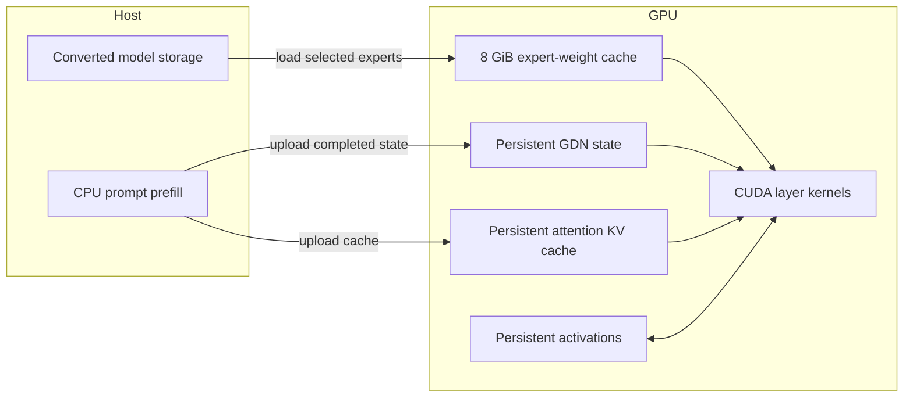
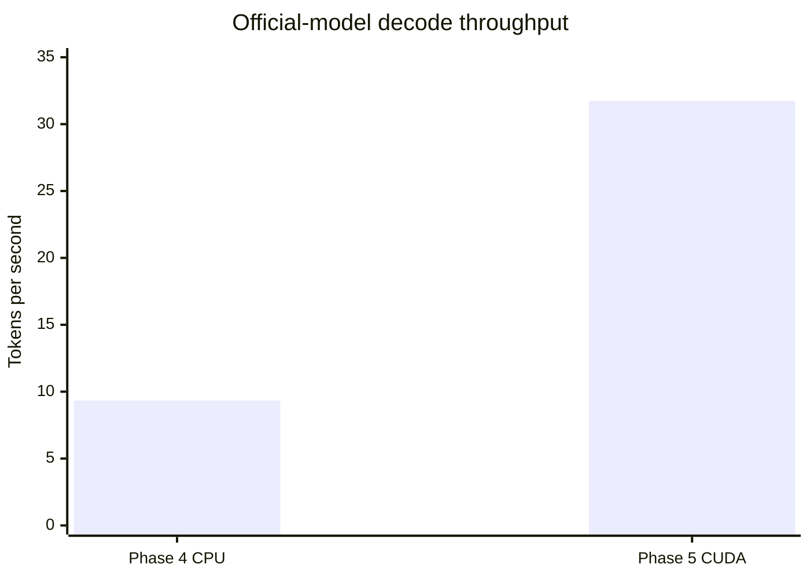

# Phase 5 Research Report: A Persistent CUDA Backend for Hybrid Qwen3.5

**Project:** colib
**GPU:** NVIDIA GeForce RTX 5070 Ti
**CUDA compiler:** nvcc 12.9.86, target `sm_120`
**Host compiler:** GCC 13.3
**Report date:** 24 July 2026
**Retrospective status:** Gate completed

## Abstract

Phase 5 designed and validated a CUDA backend for the hybrid Qwen3.5 runtime.
The final design retained recurrent state, attention caches, activations, and a
bounded expert cache on the GPU. It implemented normalization, activations,
residual operations, int8 and grouped-int4 matrix-vector multiplication,
Gated DeltaNet, gated grouped-query attention, routed and shared experts, and
the language-model head.

The tiny-model CUDA path matched 32 teacher-forced and 32 greedy tokens in
unquantized, int8, and grouped-int4 modes. On the official 35B model, fixed-set
teacher-forced agreement with llama.cpp was 1,231/1,280, identical in aggregate
to the CPU result, while free-running agreement was 756/1,280. Warm-cache
decode runs measured 31.75, 31.87, and 30.46 tokens/s, giving a median of 31.75
tokens/s. This was 3.40 times the Phase 4 CPU baseline of 9.34 tokens/s.

## 1. Research question

Can the Qwen3.5 hybrid recurrent/attention/MoE forward pass be moved to a
consumer GPU while retaining bounded memory use and the established numerical
acceptance criteria?

CUDA acceleration is not simply a compiler switch. GPU performance depends on
where state lives, how often kernels are launched, and how much weight data
crosses the CPU/GPU boundary.

## 2. Technical background

A **CUDA kernel** is a function executed by many GPU threads. A **kernel
launch** schedules that function from the CPU. Launching many tiny kernels can
cost enough time to reduce the benefit of GPU arithmetic.

**VRAM** is memory attached to the GPU. Keeping recurrent state and frequently
used weights in VRAM avoids transfers across PCI Express, but the full model is
larger than available VRAM.

A **stream** is an ordered queue of GPU operations. Nonblocking streams allow
copies and compute to overlap when dependencies permit. **Pinned host memory**
cannot be paged out by the operating system and supports efficient asynchronous
GPU transfer.

## 3. Method

### 3.1 Backend boundary and unit kernels

A C-compatible backend interface separated model logic from CUDA
implementation. Deterministic unit tests were first created for:

- RMS normalization;
- SiLU activation;
- vector addition and scaling;
- int8 GEMV;
- grouped-int4 GEMV with fp32 and fp16 activation inputs.

The maximum recorded absolute kernel differences were:

| Kernel | Maximum difference |
|---|---:|
| RMSNorm | \(4.77\times10^{-7}\) |
| SiLU | \(9.31\times10^{-10}\) |
| AXPY/residual | \(7.45\times10^{-9}\) |
| Int8 GEMV | \(8.11\times10^{-6}\) |
| Int4 GEMV, fp32 input | \(1.31\times10^{-6}\) |
| Int4 GEMV, fp16 input | \(1.00\times10^{-3}\) |

### 3.2 Progressive integration

Initial offload moved isolated operations while state and orchestration
remained host-centred. Fusion raised a recorded experimental path from 5.19 to
7.88 tokens/s, still slower than the CPU baseline. This negative result led to
a persistent-state design.

The final system used CPU prefill, then uploaded prompt state to the GPU.
Decode remained on the GPU. An 8 GiB least-recently-used weight cache retained
expert tensors; the representative warm run had no decode-time misses or
evictions.

CUDA execution was opt-in and maintained explicit CPU fallbacks. This allowed
the scalar and optimized CPU paths to remain correctness controls.

### 3.3 Correctness and performance controls

The tiny model was tested in all three precision modes for 32 teacher-forced
and 32 greedy tokens. The official-model comparison reused the fixed Phase 4
twenty-prompt set.

Decode timing excluded cold model load and CPU prompt prefill. Three warm runs
were recorded, and the median was reported. Cold-start measurements were kept
separate because filesystem cache state caused a wide range.

## 4. Results

The CUDA tiny model matched 32/32 teacher-forced and 32/32 greedy tokens for
unquantized, int8, and grouped-int4 snapshots.

Official-model validation produced:

| Measurement | CUDA result |
|---|---:|
| Teacher-forced agreement | 1,231/1,280 (96.171875%) |
| Free-running agreement | 756/1,280 (59.0625%) |
| C regression tests | 13 passed |
| Python regression tests | 8 passed |
| Tokenizer cases | 10,000/10,000 |

Warm decode results were 31.75, 31.87, and 30.46 tokens/s; the median was
31.75 tokens/s. Against the Phase 4 CPU result:

\[
\mathrm{speedup}=\frac{31.75}{9.34}=3.40.
\]

A representative 2.016-second decode profile contained:

- GDN: 0.692 s;
- attention: 0.156 s;
- MoE: 1.094 s;
- language-model head: 0.053 s;
- other work: 0.021 s.

The GPU expert cache occupied approximately 7.05 GiB of VRAM. Cold load time
ranged from 9.3 to 64.2 seconds depending on storage/cache state. CPU prompt
prefill took approximately 5.4–5.9 seconds and was not included in steady-state
decode throughput.

## 5. Interpretation

The early 5.19-to-7.88 token/s result showed that isolated kernel acceleration
was insufficient. Repeated transfers and launch overhead could dominate the
small amount of arithmetic in each operation. Persistent GPU state changed the
system boundary: only required expert weights had to move during decode.

MoE remained the largest component at 1.094 of 2.016 seconds. This observation
directly informed the later Phase 6 investigation of batching tokens that share
expert routes.

The official-model aggregate teacher-forced match equalled the CPU result,
although individual prompt choices could shift because CPU and GPU reductions
sum floating-point products in different orders. The gate therefore assessed
the CUDA path against the fixed numerical criteria rather than requiring
CPU/CUDA bit identity.

## 6. Limitations

The reported 31.75 tokens/s is warm-cache decode throughput, not time to first
token. It excludes model load and CPU prompt prefill. Cold-start time varied by
nearly sevenfold, showing that storage and operating-system caching were not
fully controlled.

Measurements used one GPU architecture and CUDA version. The 8 GiB expert
cache was suitable for the RTX 5070 Ti but is not universally optimal. Prompt
prefill remained on the CPU by design, so long prompts do not receive the full
decode speedup. The comparison used greedy decoding and the quantized Phase 4
reference rather than a full BF16 baseline.

## 7. Conclusion

Phase 5 produced a numerically validated, persistent CUDA decode path with a
3.40-fold median speedup over the recorded CPU baseline. The experiment also
identified a clear remaining bottleneck: routed and shared MoE work accounted
for more than half of representative decode time. That result supplied the
performance baseline and motivation for Phase 6 speculative decoding.
