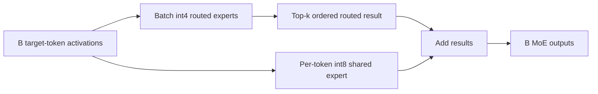

# Experiment 1: Expert-Route Overlap and Mixed-Precision MoE Batching

**Phase:** 6 — MTP speculative decoding
**Date:** 24 July 2026
**Model:** Qwen3.5-35B-A3B
**Hardware:** RTX 5070 Ti (`sm_120`)
**Outcome:** D1 routed-expert batching retained and enabled by default

> **Superseded performance note (25 July 2026):** Experiment 2 found that the
> original batch kernel changed floating-point operation order by up to
> \(1.41\times10^{-5}\) per measured layer and changed one code-domain token.
> The kernel is now arithmetic-order exact. The 30.24/31.03 tok/s comparison
> below describes the earlier implementation and is not the current Gate-6
> result. See
> [Experiment 2](phase6_experiment_02_multidomain.md).

## Research question

Does a speculative target block route neighboring tokens to enough of the same
experts for a weight-reusing CUDA MoE kernel to improve end-to-end decoding?

## Motivation

Every target token selects eight routed experts in each layer. If two tokens
select the same expert, the kernel may reuse that expert's quantized weights.
If their selections are disjoint, batching can still reduce kernel launches,
but it cannot reduce much weight traffic.

The earlier Phase 6 measurements did not count actual batch transactions.
This experiment added explicit telemetry before drawing another kernel-level
conclusion.

## Method

Three measured-only counters were added:

- batch transactions;
- total token/expert routes;
- total unique experts within each layer and verification block.

The counters are reset after the 64-token warmup. The reported overlap is:

```text
overlap = 1 - unique_experts / total_routes
```

The workload uses the standard `Hello` ChatML prompt, 64 generated tokens,
eight OpenMP threads, 64 CPU expert slots per layer, four prefetch threads, and
an 8 GiB CUDA expert cache.

## Experimental-control discovery

The first instrumented 35B run reported zero batch transactions. Inspection
showed that the experimental function required:

```text
routed experts = int4
shared expert  = int4
```

The tiny oracle satisfies this condition, but the real conversion uses:

```text
routed experts = int4-g128
shared expert  = int8
```

The real model had therefore taken the exact per-token fallback. Earlier
differences labelled as batch-kernel results were ordinary run-to-run
variation. They were removed from the validated results in the main Phase 6
report.

## Correction

The corrected transaction separates the precision paths:



The routed kernel:

1. compacts `B × K` routes into unique experts;
2. applies one quantized expert row to every participating token;
3. stores contributions in original route order;
4. reduces the eight routes in original top-k order.

This preserves the CUDA target's output while permitting weight reuse. The
existing int8 shared-expert implementation remains unchanged.

## Results

All configurations emitted the same 64 greedy token IDs as `MTP=0`.

| Draft | Acceptance | Transactions | Routes/transaction | Unique/transaction | Overlap | Decode |
|---:|---:|---:|---:|---:|---:|---:|
| 1 | 88.2% | 1,360 | 16.00 | 13.48 | 15.74% | **30.24 tok/s** |
| 2 | 81.2% | 1,080 | 23.11 | 17.40 | 24.72% | 28.84 tok/s |
| 3 | 78.9% | 1,000 | 29.12 | 20.65 | 29.09% | 29.08 tok/s |

Relevant comparisons:

| Configuration | Decode | MoE time |
|---|---:|---:|
| MTP disabled | 31.03 tok/s | 1.124 s |
| D1, per-token routed experts | 28.91 tok/s | 1.221 s |
| D1, corrected routed batch | **30.24 tok/s** | **1.116 s** |

For D1, batching improves speculative throughput by:

```text
30.24 / 28.91 - 1 = 4.6%
```

The corrected speculative path reaches:

```text
30.24 / 31.03 = 97.5% of the non-speculative baseline
```

## Interpretation

The hypothesis was partly supported.

- Route overlap is real but modest at D1.
- Fewer routed-expert launches provide a useful gain even with only 15.74%
  overlap.
- Larger blocks increase overlap, but their lower MTP acceptance causes more
  rejection and replay.
- D1 remains the best complete decoding policy.

The experiment also shows why transaction telemetry is a necessary control.
Correct token output alone proves numerical safety, but it does not prove that
the intended optimization executed.

## Decision

The corrected routed-expert batch is retained and enabled by default when
`CUDA_SPEC_FULL=1`. `CUDA_SPEC_MOE_BATCH=0` preserves the per-token fallback.

Gate 6 remains open. The result is 2.5% below the matching baseline and well
below the 1.3-fold target of 40.34 tokens per second.

## Next research step

The next experiment should measure MTP acceptance and route overlap over a
small, fixed multi-domain prompt set rather than a single prompt. This will
determine whether D1 remains the best policy for code, prose, multilingual
text, and structured data, and whether an adaptive draft-depth policy is
justified.
