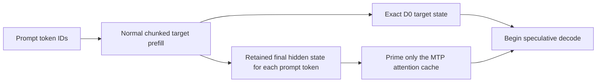
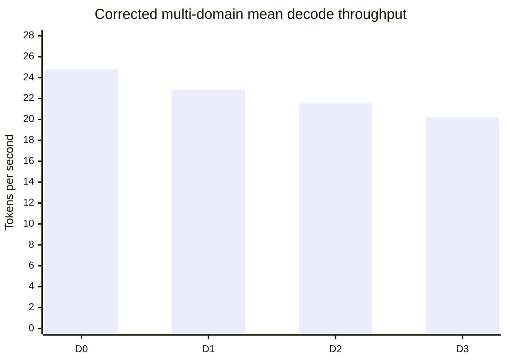
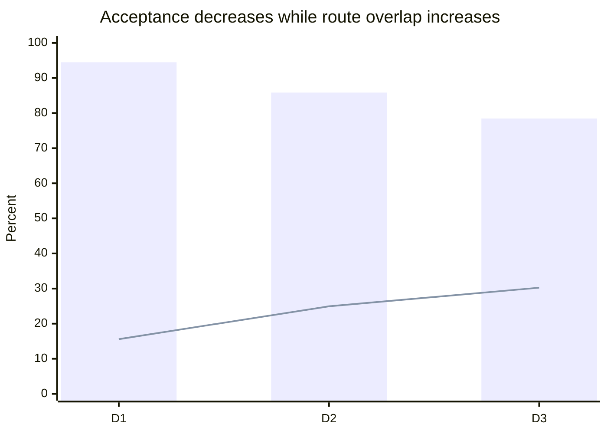

# Experiment 2: Multi-Domain MTP Acceptance and Exact CUDA Batching

**Phase:** 6 — MTP speculative decoding
**Date:** 25 July 2026
**Model:** Qwen3.5-35B-A3B
**Hardware:** AMD Ryzen 7 7700X, RTX 5070 Ti (`sm_120`)
**Outcome:** D1 retained; adaptive depth rejected; Gate 6 remains open

## Abstract

This experiment tested whether the best multi-token-prediction (MTP) draft
depth depends on the kind of text being generated. Five fixed prompts covered
TypeScript code, technical prose, mixed-language text, structured JSON, and
ordinary conversation. For each prompt, a non-speculative baseline (D0) and
draft depths D1, D2, and D3 generated 64 tokens after a 64-token warmup.

The first experiment attempt exposed two correctness defects and its
performance measurements were invalidated. MTP mode had prepared the target
prompt with sequential CUDA decoding while D0 used the validated chunked
prefill. In addition, the batched routed-expert kernel changed floating-point
operation order. Its maximum per-layer output difference was only
\(1.41\times10^{-5}\), but this was sufficient to change one later code token.
MTP prefill was changed to retain hidden states from the normal target prefill.
The batch kernel was changed to use the single-token multiplication and route
reduction order. The standalone CUDA batch difference and 480 short
real-model comparisons then both became exactly zero.

In the corrected study, all 15 speculative token streams exactly matched their
five D0 baselines. Weighted acceptance was 94.48% for D1, 85.84% for D2, and
78.45% for D3. Route overlap increased from 15.59% to 30.25% as depth
increased, but throughput decreased. Mean throughput was 24.79 tokens per
second for D0, 22.85 for D1, 21.54 for D2, and 20.20 for D3. The paired
geometric speed ratios were 0.924, 0.865, and 0.811 respectively.

The official `Hello` gate prompt behaved better than the multi-domain mean.
Across three corrected paired samples, median D0 throughput was 30.49 tokens
per second and median D1 throughput was 31.28, a 2.6% gain. The result remains
far below the required 1.3-fold target of 39.64 tokens per second.

## 1. Research question

Does MTP acceptance and expert-route overlap vary enough across text domains
to justify changing draft depth dynamically?

A **draft depth** is the maximum number of future tokens proposed by the small
MTP predictor. D1 proposes one future token, D2 proposes two, and D3 proposes
three. Deeper drafts can reduce the number of full-model verification calls,
but a rejected proposal requires state restoration and replay.

The hypothesis was:

> Predictable formats such as code or JSON will accept deeper drafts often
> enough that their greater expert overlap outweighs replay cost.

## 2. Experimental design

### 2.1 Prompt set

The fixed prompt set contained:

| ID | Domain | Requested behavior |
|---|---|---|
| `code` | TypeScript | Stable topological sort, complexity, and tests |
| `technical` | Systems prose | Explain inference bandwidth and launch latency |
| `multilingual` | Chinese, Japanese, English, emoji | Explain and summarize a cache concept |
| `json` | Structured data | Return a strict task-list schema |
| `conversation` | Ordinary planning | Plan a calm Saturday |

The complete prompt strings are stored in
`c/tools/bench_mtp_domains.py`.

### 2.2 Controls

Every run used:

- 64 warmup tokens and 64 measured tokens;
- ChatML formatting and greedy decoding;
- eight OpenMP threads;
- 64 CPU expert slots per layer;
- four prefetch workers;
- an 8 GiB CUDA expert cache;
- exact CUDA GDN and routed-MoE batching;
- `MTP_MIN_ACCEPT=0`, preventing the adaptive pause from silently disabling a
  low-acceptance configuration;
- `CUDA_PRELOAD=0` for both D0 and speculative paths.

The D0/D1/D2/D3 order was rotated between prompts to reduce a simple monotonic
temperature or order bias. The benchmark engine hash was
`8011662b61a220a9e98f38cea559cc19754c6ae5b0939924abacbf7926dbd346`.

The runner failed the experiment if:

1. a speculative token differed from its prompt's D0 token;
2. MTP telemetry was absent; or
3. a requested CUDA batch path recorded zero transactions.

## 3. Correctness-control discoveries

### 3.1 Different target prefill paths

The first attempted matrix stopped because all code-domain speculative runs
diverged from D0 at generated token 49. This was not treated as an acceptable
quantization difference: speculative decoding promises the output of its own
target path.

D0 used the normal chunked target prefill. MTP mode instead advanced the target
one token at a time so it could obtain hidden states for the MTP cache. These
methods are close numerically but not identical.

The corrected method is:



The target is now prepared by exactly the same prefill algorithm in D0 and MTP
mode. Saved prompt hidden states are observational data; using them to prime
MTP does not change target recurrence.

### 3.2 Batched MoE arithmetic order

After prefill was matched, single-token speculative verification reproduced D0
exactly, while CUDA block verification still changed one code token.
Controlled fallbacks showed:

- per-token GDN plus per-token MoE: exact;
- batched GDN plus per-token MoE: exact;
- per-token GDN plus batched MoE: divergent.

The batched MoE result differed from the established single-token result by at
most \(1.4066696\times10^{-5}\) in the measured real-model layers.

The mathematical expression was the same, but the implementation changed
rounding order:

```text
single token: activation × quantized_value × scale
old batch:    activation × (quantized_value × scale)
```

It also multiplied each route weight before storing the route result, then
summed those rounded values in a second kernel. The single-token kernel
multiplied the route weight during the ordered sum.

The batch kernel now follows the single-token expression and applies route
weights during the final top-k-ordered reduction. This retains shared weight
reads across tokens while restoring exact arithmetic order.

Validation after the change produced:

- standalone CUDA `batch-moe maxdiff=0`;
- 480 full-model layer/block comparisons with maximum difference 0;
- 64/64 code-prompt token identity;
- 15/15 corrected multi-domain stream identities.

## 4. Results

### 4.1 Per-domain results

| Prompt | Depth | Acceptance | Overlap | Replay | Expert misses | Decode |
|---|---:|---:|---:|---:|---:|---:|
| Code | D0 | — | — | — | 684 | 22.08 tok/s |
| Code | D1 | 88.2% | 17.04% | 0.116 s | 1,192 | **21.78 tok/s** |
| Code | D2 | 81.2% | 25.84% | 0.272 s | 1,432 | 20.08 tok/s |
| Code | D3 | 66.7% | 30.25% | 0.587 s | 1,640 | 17.34 tok/s |
| Technical | D0 | — | — | — | 103 | 27.75 tok/s |
| Technical | D1 | 96.9% | 14.53% | 0.028 s | 418 | 24.57 tok/s |
| Technical | D2 | 91.1% | 25.13% | 0.132 s | 486 | **24.83 tok/s** |
| Technical | D3 | 83.3% | 28.66% | 0.362 s | 614 | 22.36 tok/s |
| Multilingual | D0 | — | — | — | 418 | 23.93 tok/s |
| Multilingual | D1 | 96.9% | 15.80% | 0.030 s | 1,084 | **21.50 tok/s** |
| Multilingual | D2 | 87.0% | 24.18% | 0.254 s | 1,250 | 19.86 tok/s |
| Multilingual | D3 | 88.5% | 31.74% | 0.248 s | 1,504 | 19.67 tok/s |
| JSON | D0 | — | — | — | 114 | 26.38 tok/s |
| JSON | D1 | 93.9% | 16.94% | 0.063 s | 451 | 22.92 tok/s |
| JSON | D2 | 97.7% | 26.15% | 0.052 s | 468 | **24.47 tok/s** |
| JSON | D3 | 85.2% | 32.52% | 0.204 s | 699 | 23.93 tok/s |
| Conversation | D0 | — | — | — | 460 | 23.80 tok/s |
| Conversation | D1 | 96.9% | 13.51% | 0.033 s | 1,018 | **23.50 tok/s** |
| Conversation | D2 | 74.5% | 23.72% | 0.381 s | 1,382 | 18.45 tok/s |
| Conversation | D3 | 71.7% | 28.59% | 0.483 s | 1,343 | 17.70 tok/s |

Bold speculative values are the fastest speculative depth for that prompt.
Every D0 value remains faster than its prompt's best speculative value.

### 4.2 Aggregate results

| Depth | Mean decode | Paired geometric speed ratio | Weighted acceptance | Weighted overlap | Total expert misses |
|---:|---:|---:|---:|---:|---:|
| D0 | **24.79 tok/s** | 1.000 | — | — | 1,779 |
| D1 | 22.85 tok/s | **0.924** | **94.48%** | 15.59% | 4,163 |
| D2 | 21.54 tok/s | 0.865 | 85.84% | 24.94% | 5,018 |
| D3 | 20.20 tok/s | 0.811 | 78.45% | 30.25% | 5,800 |



Deeper drafts created more route overlap, but also more rejection replay and
expert-cache pressure:



### 4.3 Official gate prompt

The corrected `Hello` D0/D1 pair was repeated three times:

| Repetition | D0 | D1 | Paired D1/D0 |
|---:|---:|---:|---:|
| 1 | 31.06 tok/s | 31.96 tok/s | 1.029 |
| 2 | 29.58 tok/s | 31.12 tok/s | 1.052 |
| 3 | 30.49 tok/s | 31.28 tok/s | 1.026 |
| **Median** | **30.49 tok/s** | **31.28 tok/s** | **1.029 median ratio** |

D1 therefore produces a small repeatable improvement on the gate prompt.
However:

```text
31.28 / 30.49 = 1.026
required throughput = 1.3 × 30.49 = 39.64 tok/s
```

## 5. Interpretation

### 5.1 Draft depth

D1 is the best fixed policy. It was the fastest speculative mode for code,
multilingual text, and conversation, and it had the best aggregate result.
D2 narrowly led D1 for technical prose and led it more clearly for JSON.
Nevertheless, neither D1 nor D2 beat D0 on those prompts.

An adaptive depth controller would therefore add policy complexity without
turning any measured multi-domain loss into a gain. The current evidence does
not justify it.

### 5.2 Acceptance is necessary but insufficient

D1 accepted 94.48% of proposals across the five prompts, yet remained 7.6%
slower by paired geometric mean. High prediction accuracy is helpful, but it
does not guarantee speed. The cost of drafting, snapshotting, verifying extra
states, handling expert weights, and occasional replay must still be lower
than the target work removed.

### 5.3 Expert-cache pressure

Expert misses increased from 1,779 at D0 to 4,163 at D1. Speculative
verification touches future routes before all of them are known to be useful.
Rejected routes may load weights that do not contribute to emitted output.
Even accepted lookahead can disturb a bounded least-recently-used cache.

This is now a stronger optimization target than adaptive draft depth. The next
kernel/cache study should determine how many misses are:

- useful accepted-route loads;
- rejected-route pollution;
- repeated loads caused by insufficient pinning; or
- MTP-layer interference with target expert residency.

## 6. Limitations

Each domain/depth pair was measured once. The prompt set spans several
behaviors but contains only five prompts and 320 measured tokens per depth.
Processes reload the model independently, so operating-system page state and
GPU temperature still contribute noise. Rotating configuration order reduces
but does not eliminate this effect.

The `Hello` gate result has three paired repetitions and is stronger as a
timing claim, but it remains one short prompt. No power or energy measurements
were taken. Results apply directly to the tested RTX 5070 Ti and current
custom kernels.

## 7. Decision

1. Retain D1 as the fixed MTP default.
2. Do not implement adaptive draft depth from the present evidence.
3. Retain exact GDN and routed-MoE batching.
4. Treat the older 30.24/31.03 tok/s comparison as superseded by the corrected
   exact-arithmetic implementation.
5. Investigate speculative expert-cache pollution before attempting a more
   complex depth policy.
6. Keep Gate 6 open. The corrected median gate result is 31.28 tok/s against a
   39.64 tok/s requirement.

## 8. Reproduction

Build and validate:

```sh
make -C c CUDA=1 CUDA_ARCH=sm_120 qwen
make -C c test-c
make -C c test-python
make -C c CUDA=1 CUDA_ARCH=sm_120 test-cuda
.venv/bin/python c/tests/test_tok_qwen.py
```

Run and summarize the fixed experiment:

```sh
.venv/bin/python c/tools/bench_mtp_domains.py \
  --output c/bench/mtp_domains_corrected.json
.venv/bin/python c/tools/analyze_mtp_domains.py \
  c/bench/mtp_domains_corrected.json
```

Run the official gate pair:

```sh
.venv/bin/python c/tools/bench_mtp_domains.py \
  --gate-hello --depth 0 --depth 1 \
  --output c/bench/mtp_hello_corrected.json
```

## 9. Subsequent result

[Experiment 3](phase6_experiment_03_cache_attribution.md) added stage-specific
cache instrumentation, corrected an MTP tensor-name lookup, and isolated the
observed MTP expert working set. A new five-domain D0/D1 run improved the
paired geometric ratio from 0.924 in this report to 1.031 while preserving
exact tokens. The original results remain here because they are the controlled
evidence that motivated the cache experiment.
