# Phase 6 Experiment 3: Expert-Cache Attribution and MTP Pinning

**Project:** colib
**Model:** Qwen3.5-35B-A3B
**Hardware:** AMD Ryzen 7 7700X and NVIDIA GeForce RTX 5070 Ti 16 GB
**Date:** 25 July 2026
**Status:** Completed; optimization retained; Gate 6 remains open

## Abstract

This experiment studied why lossless multi-token prediction (MTP) remained
slower than ordinary decoding across five prompt domains even though 94.48% of
depth-1 proposals were accepted. We added stage-specific expert-cache counters
for drafting, target verification, and rejection replay. The first controlled
`Hello` measurement attributed all 78 observed misses to the MTP drafter. Code
inspection then found that the CUDA cache lookup constructed target-model
tensor names for the MTP layer. Correcting the names eliminated these misses
on `Hello`, but a five-domain rerun reached only 0.972 times baseline speed.

The broader measurements showed a second effect: the target and MTP experts
shared one least-recently-used cache. Although the MTP layer is small, its
weights displaced target experts during speculative transactions. We therefore
placed only the MTP experts actually encountered into a separately accounted,
non-evicting pool. This used 0.42--0.48 GiB on the five-domain workload.
Drafter misses fell to zero and target-verification misses fell from 3,819 to
1,754. Every generated token remained identical. The paired geometric-mean
speed ratio improved from 0.972 to 1.031, with four of five domains faster than
baseline.

Three final `Hello` pairs produced median throughputs of 30.05 tokens per
second without MTP and 31.84 with depth-1 MTP, a 1.060-fold speed-up. This is a
real improvement over Experiment 2's 1.026-fold result, but it remains below
the required 1.3-fold value of 39.07 tokens per second. Gate 6 therefore
remains open.

## 1. Research question

Where do expert-cache misses occur during speculative decoding, and can a
small cache-policy change convert high MTP acceptance into higher throughput?

An **expert** is one small feed-forward network inside a mixture-of-experts
(MoE) layer. A router selects eight experts for each token. An expert-cache
**miss** occurs when a selected expert is not already resident in the fast
cache and its weights must be loaded. A **least-recently-used (LRU)** cache
normally removes the weight that has gone unused for the longest time.

## 2. Hypotheses

Two hypotheses were tested:

1. cache misses are concentrated in one stage of the speculative transaction;
2. if MTP and target experts interfere, isolating the small MTP working set
   will preserve target locality and improve speed.

The second change was intentionally limited. It does not pin the entire
checkpoint. It pins only MTP experts reached by the measured generation and
reports their memory separately.

## 3. Method

### 3.1 Stage attribution

The engine records the expert-miss counter before and after each stage:

```text
MTP draft -> target block verification -> rejection replay
```

It emits:

```text
[MTP_CACHE] draft_misses=... verify_misses=...
            replay_misses=... other_misses=... total_misses=...
```

This establishes where a miss occurs, although it does not by itself prove why
the miss occurred.

### 3.2 Controlled workloads

All measurements used:

- 64 warm-up tokens and 64 measured tokens;
- greedy ChatML decoding;
- eight CPU threads;
- an 8 GiB target-expert CUDA cache;
- the exact CUDA block-verification path;
- `MTP_MIN_ACCEPT=0`, so no adaptive pause changed the workload;
- depth 0 as the ordinary-decoding control and depth 1 as the treatment.

The five fixed prompts cover TypeScript code, technical explanation,
multilingual text, JSON generation, and conversation. Configuration order was
rotated to reduce systematic warm-order bias.

### 3.3 Correctness control

The complete generated token-ID list from every speculative run was compared
with its paired depth-0 list. Any difference invalidated the run. All streams
reported in this paper were identical.

## 4. Results

### 4.1 Initial attribution and tensor-name defect

The first `Hello` depth-1 pilot measured 78 total misses:

| Stage | Misses |
|---|---:|
| MTP draft | 78 |
| target verification | 0 |
| rejection replay | 0 |

The MTP layer is represented internally as layer 40, immediately after the 40
target layers. The cache helper incorrectly looked for names beginning with
`layers.40.mlp.experts`. The checkpoint instead stores these tensors under
`mtp.layers.0.mlp.experts`. As a result, already uploaded MTP weights could not
be found by their correct keys.

After correcting the lookup, the `Hello` pilot had zero misses and improved
from 31.28 to 32.10 tokens per second in an unpaired diagnostic run.

### 4.2 Name correction alone

The corrected five-domain depth-1 run still showed many misses during target
verification:

| Prompt | D0 tok/s | D1 tok/s | D1 draft misses | D1 verify misses |
|---|---:|---:|---:|---:|
| code | 22.82 | 21.08 | 31 | 1,128 |
| technical | 25.41 | 24.49 | 28 | 344 |
| multilingual | 23.63 | 23.26 | 28 | 1,004 |
| JSON | 25.67 | 24.55 | 21 | 385 |
| conversation | 22.75 | 23.60 | 32 | 958 |
| **sum/mean** | **24.06** | **23.40** | **140** | **3,819** |

The paired geometric-mean speed ratio was 0.972. The key correction was
necessary, but not sufficient.

### 4.3 Separately pinned MTP working set

MTP expert entries are now recognized by the `mtp.` tensor-name prefix. They
are retained outside the target expert LRU and counted as
`mtp-expert-VRAM`. Target experts continue to obey the original 8 GiB bound.

| Prompt | D0 tok/s | pinned D1 tok/s | Speed ratio | Acceptance | D1 verify misses |
|---|---:|---:|---:|---:|---:|
| code | 22.35 | 22.95 | 1.027 | 88.2% | 642 |
| technical | 27.61 | 28.85 | 1.045 | 96.9% | 111 |
| multilingual | 23.45 | 25.32 | 1.080 | 96.9% | 421 |
| JSON | 26.08 | 25.10 | 0.962 | 93.9% | 121 |
| conversation | 24.11 | 25.16 | 1.044 | 96.9% | 459 |
| **mean** | **24.72** | **25.48** | **1.031 geometric** | **94.48% weighted** | **1,754 total** |

All five pinned runs recorded zero draft misses and zero replay misses.

```mermaid
xychart-beta
    title "Paired throughput after MTP expert pinning"
    x-axis ["Code", "Technical", "Multilingual", "JSON", "Conversation"]
    y-axis "tokens per second" 20 --> 30
    bar [22.35, 27.61, 23.45, 26.08, 24.11]
    bar [22.95, 28.85, 25.32, 25.10, 25.16]
```



The first bar in each pair is depth 0; the second is pinned depth 1.

The measured MTP pool occupied 0.42--0.48 GiB across the five-domain runs.
The `Hello` workload occupied 0.38 GiB. These values describe experts reached
by these workloads, not a guaranteed upper bound for every future prompt.

### 4.4 Official `Hello` performance gate

| Pair | D0 tok/s | pinned D1 tok/s | Ratio |
|---|---:|---:|---:|
| 1 | 30.05 | 31.84 | 1.060 |
| 2 | 29.29 | 31.77 | 1.085 |
| 3 | 30.59 | 31.93 | 1.044 |
| **median** | **30.05** | **31.84** | **1.060** |

All three speculative runs accepted 30 of 34 proposals (88.2%), generated the
same 64 token IDs as their controls, and recorded zero measured expert misses.
The required 1.3-fold result is:

\[
30.05 \times 1.3 = 39.07\ \text{tokens per second}.
\]

Depth 2 and depth 3 were retested after pinning. They reached 29.46 and 30.05
tokens per second against a paired 30.66 depth-0 result, so depth 1 remains the
best fixed depth.

## 5. Interpretation

The experiment supports both hypotheses. Stage attribution exposed a concrete
tensor-name bug, and separating the MTP working set substantially reduced
cache interference. The five-domain result changed from a 2.8% slowdown to a
3.1% speed-up. This is meaningful because it occurred without relaxing output
identity.

However, the official workload has zero misses after warm-up and still reaches
only 1.060-fold speed. Cache policy is therefore no longer its principal
bottleneck. Its measured depth-1 time is approximately:

```text
0.08 s drafting + 1.77 s verification + 0.12 s rejection replay
```

Verification still dominates. Depth 1 verifies two target positions at a
time, but expert-route overlap is only about 16%. The batch therefore reuses
some weights and launch overhead, but not enough to reach 1.3-fold speed.

## 6. Limitations

- Measurements were made on one GPU and one 35B quantized checkpoint.
- Each sample generated 64 tokens; longer runs may change routing locality.
- The five prompts improve domain coverage but are not a statistical sample of
  all real applications.
- The pinned MTP pool is workload-dependent and consumes additional VRAM.
- Stage counters identify when loads occur, but do not classify every target
  miss as compulsory, capacity, or rejected-route pollution.

## 7. Decision and next experiment

The corrected MTP key mapping, stage counters, and separate MTP expert pool are
retained. Depth 1 remains the default experimental depth. Gate 6 remains open,
and Phase 7 must not begin.

The next experiment should address verification rather than enlarge the cache:

1. record MTP confidence for accepted and rejected proposals;
2. determine whether low-confidence transactions can be skipped before costly
   target-block verification;
3. measure the maximum benefit available from eliminating rejection replay;
4. only then consider a more complex verification kernel.

This ordering prevents a large CUDA rewrite before establishing whether
rejections or the accepted-path kernel dominate the remaining gap.

### Subsequent result

[Experiment 4](phase6_experiment_04_confidence_admission.md) found that the
MTP top-two logit margin predicts acceptance well enough for conservative
transaction admission. With margin 2.0, five-domain performance rose from
1.031 to 1.104 times baseline and the official median rose from 31.84 to
35.25 tokens per second, with exact output and zero replay.

## 8. Reproduction

```bash
make -C c CUDA=1 CUDA_ARCH=sm_120 qwen

python3 c/tools/bench_mtp_domains.py \
  --depth 0 --depth 1 \
  --output c/bench/mtp_domains_mtp_pinned_d01.json

python3 c/tools/analyze_mtp_domains.py \
  c/bench/mtp_domains_mtp_pinned_d01.json

python3 c/tools/bench_mtp_domains.py \
  --gate-hello --depth 0 --depth 1 \
  --output c/bench/mtp_hello_mtp_pinned_r1.json
```

The last command was repeated for `r2` and `r3`.
