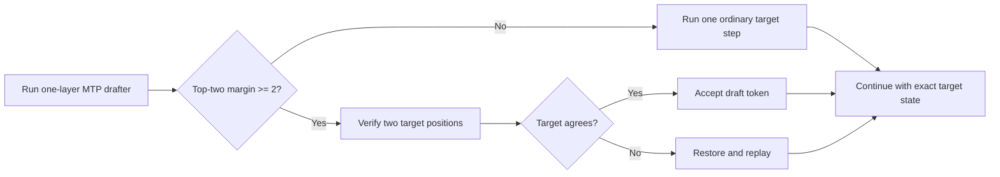

# Phase 6 Experiment 4: Confidence-Aware Speculative Admission

**Project:** colib
**Model:** Qwen3.5-35B-A3B
**Hardware:** AMD Ryzen 7 7700X and NVIDIA GeForce RTX 5070 Ti 16 GB
**Date:** 25 July 2026
**Status:** Completed; opt-in policy retained; Gate 6 remains open

## Abstract

Experiment 3 removed measured expert-cache misses from the official gate
workload, but depth-1 multi-token prediction (MTP) still spent about 0.12
seconds restoring and replaying state after four rejected proposals. This
experiment tested whether the MTP model's own confidence could identify
unprofitable speculative transactions before target-block verification.

Confidence was measured as the raw logit difference between the MTP model's
highest-scoring token and its second-highest-scoring token. On an ungated
five-domain labeling run, a margin threshold of 2.0 admitted 139 of 154
accepted proposals and only one of nine rejected proposals. This corresponds
to 99.3% admission precision and 90.3% recall for accepted proposals. The rule
conservatively skipped 15 proposals that would have been accepted.

An opt-in `MTP_MIN_MARGIN=2` policy was then evaluated. A low-confidence draft
was not emitted or trusted; the engine performed one ordinary target step and
continued. This preserves the target model's exact greedy output. Across five
domains, all 142 admitted proposals were accepted, 32 transactions were
skipped, replay time was zero, and every generated token matched depth 0. The
paired geometric-mean speed ratio increased from 1.031 with cache pinning alone
to 1.104.

Three official `Hello` pairs produced median throughput of 35.25 tokens per
second for confidence-gated depth 1 and 30.99 for depth 0, a 1.138-fold
speed-up. This is the best Phase 6 result so far, but the 1.3-fold requirement
is now 40.29 tokens per second. Gate 6 remains open.

## 1. Research question

Can MTP confidence identify transactions whose expected verification and
replay cost is greater than the benefit of speculation?

In ordinary greedy decoding, the model produces a score called a **logit** for
every possible next token. The token with the largest logit is selected. The
**top-two margin** used here is:

\[
m = \text{largest logit} - \text{second-largest logit}.
\]

A large margin means the drafter strongly prefers one token. It does not prove
that the full target agrees, but it may be a useful confidence signal.

## 2. Hypothesis

Rejected MTP proposals will generally have smaller margins than accepted
proposals. If so, low-margin drafts can be sent through one ordinary target
step rather than a two-position target block followed by rollback and replay.
The fallback remains lossless because no low-confidence draft token is
emitted.

## 3. Implementation

### 3.1 Instrumentation

For each MTP proposal, the engine records the top-two margin. After target
verification it classifies the proposal as:

- **accepted:** the target selected the same token;
- **rejected:** the first verified disagreement;
- **unverified:** a proposal deliberately skipped or beyond an earlier
  rejection.

Margins are reported in five bins:

```text
<0.25, 0.25--0.5, 0.5--1, 1--2, and >=2
```

### 3.2 Admission policy

`MTP_MIN_MARGIN=N` enables the experimental policy. With `N=2`:



The MTP attention position is rewound to the committed position on fallback.
This prevents speculative cache rows from changing later MTP predictions.

The feature is opt-in. A missing or zero `MTP_MIN_MARGIN` retains the ungated
behavior.

## 4. Methods

### 4.1 Labeling study

An ungated depth-1 run generated 64 tokens for each fixed domain prompt:
TypeScript code, technical prose, multilingual text, JSON, and conversation.
It used the pinned MTP expert pool from Experiment 3. Every proposal was
verified, which provided true accepted/rejected labels.

### 4.2 Policy study

The same five prompts were run as paired D0/D1 processes with
`MTP_MIN_MARGIN=2`. Controls remained:

- greedy ChatML generation;
- 64 warm-up and 64 measured tokens;
- eight CPU threads;
- 8 GiB target expert cache;
- exact CUDA block verification;
- depth 1;
- full token-list comparison against D0.

### 4.3 Official gate

The `Hello` policy workload was repeated three times. Each pair used a fresh
process and compared the exact 64 generated token IDs.

## 5. Results

### 5.1 Ungated confidence labels

The five-domain ungated run produced 154 accepted and nine rejected
proposals.

| Actual outcome | Margin < 2 | Margin >= 2 | Total |
|---|---:|---:|---:|
| accepted | 15 | 139 | 154 |
| rejected | 8 | 1 | 9 |

If margin 2 is interpreted as an admission classifier:

- precision: \(139/(139+1)=99.3\%\);
- recall for accepted proposals: \(139/154=90.3\%\);
- rejected-proposal detection: \(8/9=88.9\%\).

The rule is deliberately conservative. It avoids most rejections but also
skips 15 proposals that would have succeeded.

Mean accepted margins ranged from 5.28 on code to 8.12 on multilingual text.
Mean rejected margins ranged from 0.09 on JSON to 1.63 on code. One rejected
code proposal had margin at least 2, showing that confidence is informative
rather than infallible.

### 5.2 Confidence-gated five-domain performance

| Prompt | D0 tok/s | Gated D1 tok/s | Ratio | Skipped | Admitted acceptance |
|---|---:|---:|---:|---:|---:|
| code | 22.14 | 25.06 | 1.132 | 7 | 28/28 |
| technical | 26.72 | 27.51 | 1.030 | 9 | 27/27 |
| multilingual | 24.37 | 26.77 | 1.098 | 1 | 31/31 |
| JSON | 23.16 | 26.60 | 1.149 | 7 | 28/28 |
| conversation | 22.96 | 25.60 | 1.115 | 8 | 28/28 |
| **aggregate** | **23.87 mean** | **26.31 mean** | **1.104 geometric** | **32** | **142/142** |

```mermaid
xychart-beta
    title "Confidence-gated depth-1 throughput"
    x-axis ["Code", "Technical", "Multilingual", "JSON", "Conversation"]
    y-axis "tokens per second" 20 --> 30
    bar [22.14, 26.72, 24.37, 23.16, 22.96]
    bar [25.06, 27.51, 26.77, 26.60, 25.60]
```



The first bar in each pair is D0; the second is confidence-gated D1.

All five D1 token streams were identical to their paired controls. Draft and
replay misses were zero, and measured replay time was exactly zero. The policy
changes transaction boundaries, so the 142 admitted proposals are not the
same proposal set as the 154 accepted proposals in the labeling run.

### 5.3 Official gate

| Pair | D0 tok/s | Gated D1 tok/s | Ratio |
|---|---:|---:|---:|
| 1 | 31.21 | 35.25 | 1.129 |
| 2 | 30.59 | 35.64 | 1.165 |
| 3 | 30.99 | 34.32 | 1.107 |
| **median** | **30.99** | **35.25** | **1.138** |

Each gated D1 run skipped four low-margin transactions, admitted 30 of 30
proposals, recorded zero replay, and generated the exact D0 token list.

\[
\text{Gate target}=1.3\times30.99=40.29\ \text{tokens per second}.
\]

The current 35.25 tokens per second is about 12.5% below that target.

## 6. Interpretation

The results support the hypothesis. Top-two margin strongly predicts whether
the target will accept a draft, and a fixed threshold selected from `Hello`
improved all five held-out domain pairs. The improvement is not solely a
statistical classification result: the end-to-end engine ran faster and
retained exact output.

The policy improves performance in three ways:

1. it avoids verifying a likely-wrong extra token;
2. it avoids recurrent-state restore and replay;
3. it reduces speculative expert work and cache traffic.

It still runs the one-layer drafter before deciding, so draft cost remains.
Accepted transactions also remain dominated by target-block verification.
Consequently, confidence admission improves but cannot by itself reach 1.3
times baseline.

## 7. Limitations

- The threshold was calibrated on one short `Hello` sequence and evaluated on
  five fixed prompts, not a large independent corpus.
- Only greedy decoding was studied.
- Raw logit scale may change with another quantization or checkpoint.
- Timing samples are short and affected by consumer-GPU variability.
- The policy is conservative and deliberately loses some speculative
  opportunities.
- The labeling and policy runs have different transaction boundaries, so their
  proposal sets cannot be compared one-for-one.

## 8. Decision and next experiment

Confidence telemetry and the opt-in `MTP_MIN_MARGIN` policy are retained.
Margin 2.0 is the best measured setting for the present 35B container, but it
is not made an unconditional model-independent default.

Gate 6 remains open. The next experiment should focus on the accepted path:

1. profile verification at kernel level with replay already eliminated;
2. calculate an empirical lower bound by subtracting draft and residual
   fallback cost;
3. optimize only the dominant accepted-path kernel, likely the routed/shared
   MoE verification transaction;
4. repeat three gate pairs and the five-domain exactness study.

## 9. Regression evidence

After implementation:

- 13 C tests passed;
- 13 Python tests passed, including an all-drafts-skipped lossless fallback;
- tokenizer parity remained 10,000/10,000;
- standalone CUDA tests passed with routed batch-MoE maximum difference zero.

## 10. Reproduction

```bash
make -C c CUDA=1 CUDA_ARCH=sm_120 qwen

python3 c/tools/bench_mtp_domains.py \
  --depth 0 --depth 1 --mtp-min-margin 2 \
  --output c/bench/mtp_domains_margin2_d01.json

python3 c/tools/analyze_mtp_domains.py \
  c/bench/mtp_domains_margin2_d01.json

python3 c/tools/bench_mtp_domains.py \
  --gate-hello --depth 0 --depth 1 --mtp-min-margin 2 \
  --output c/bench/mtp_confidence_hello_margin2.json
```
