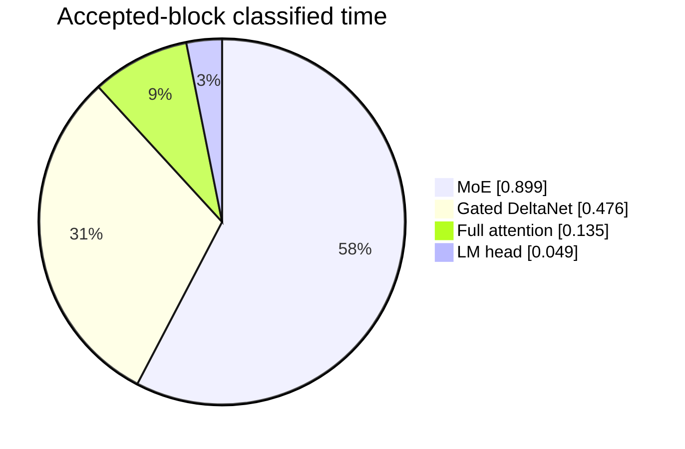

# Phase 6 Experiment 5: Accepted-Path Verification Profile

**Project:** colib
**Model:** Qwen3.5-35B-A3B
**Hardware:** AMD Ryzen 7 7700X and NVIDIA GeForce RTX 5070 Ti 16 GB
**Date:** 25 July 2026
**Status:** Complete; dominant subsystem identified and handed to Experiment 6

## Abstract

Confidence-aware admission removed rejection replay from the measured gate
workload but still fell short of the required 1.3-fold speed-up. This
experiment separates accepted target verification into Gated DeltaNet (GDN),
full attention, mixture-of-experts (MoE), and language-model-head time. It also
separates the four confidence fallbacks from accepted two-position blocks.

On the fixed `Hello` workload, one representative depth-1 run reached 35.51
tokens per second. Its accepted blocks spent approximately 0.899 seconds in
MoE, 0.476 in GDN, 0.135 in attention, and 0.049 in the language-model head.
MoE therefore represents 57.6% of classified accepted-block compute, followed
by GDN at 30.6%.

Ablation confirms that both existing batch paths are useful. Disabling routed
MoE batching reduced throughput to 34.10 tokens per second and added about
0.081 seconds of accepted MoE work. Disabling batched GDN reduced throughput
to 32.48 and added about 0.130 seconds of accepted GDN work. A trial that
scheduled routed down-projection experts on a two-dimensional CUDA grid was
numerically exact but produced inconclusive short-run timing, so it was
reverted.

The evidence selected routed/shared MoE verification as the next optimization
target. The continuation added event timing, discovered that the checkpoint's
int8 shared expert bypassed the all-int4 batch path, and closed Gate 6 with a
format-aware batch kernel. That intervention is reported separately in
[Experiment 6](phase6_experiment_06_shared_expert_gate_closure.md).

## 1. Research question

After cache misses and rejection replay are removed, which accepted-path
subsystem consumes the largest fraction of speculative verification time?

An **accepted path** is a speculative transaction in which the target agrees
with the MTP draft. It is the steady-state path worth optimizing: improvements
to rejection handling cannot accelerate transactions that already succeed.

## 2. Instrumentation

The engine now snapshots its subsystem timers around:

- target verification;
- confidence fallback;
- rejection replay.

It emits:

```text
[MTP_VERIFY_DETAIL]
verify=gdn/attn/moe/lm
fallback=gdn/attn/moe/lm
replay=gdn/attn/moe/lm
fallback_s=...
```

The accepted-block estimate is calculated by subtracting confidence-fallback
time from total verification time. Replay is already zero under the measured
margin-2 policy.

## 3. Controlled workload

The profile uses the same fixed controls as Experiment 4:

- `Hello` rendered through ChatML;
- 64 warm-up and 64 measured tokens;
- depth 1 and `MTP_MIN_MARGIN=2`;
- exact CUDA target-block verification;
- separately pinned MTP expert working set;
- 8 GiB target expert cache;
- eight CPU threads.

The representative run generated the same deterministic 64-token continuation
used by the earlier exact gate pairs.

## 4. Results

### 4.1 Accepted-block profile

The complete measured decode took 1.802 seconds, or 35.51 tokens per second.
Drafting took 0.080 seconds. Four low-confidence ordinary target steps took
0.120 seconds.

| Subsystem | Total verification | Confidence fallback | Accepted-block estimate | Accepted share |
|---|---:|---:|---:|---:|
| GDN | 0.518 s | 0.041 s | **0.476 s** | 30.6% |
| attention | 0.144 s | 0.009 s | **0.135 s** | 8.7% |
| MoE | 0.965 s | 0.066 s | **0.899 s** | 57.6% |
| LM head | 0.052 s | 0.003 s | **0.049 s** | 3.1% |
| **classified total** | **1.678 s** | **0.119 s** | **1.559 s** | **100%** |



MoE is the dominant accepted-path subsystem.

### 4.2 Gate budget

The current matched median baseline sets a target of 40.29 tokens per second.
For 64 tokens, the total time budget is:

\[
64/40.29 = 1.588\ \text{seconds}.
\]

The representative 1.802-second profile must therefore save approximately
0.214 seconds, or 11.9% of end-to-end time. Eliminating the entire 0.080-second
draft cost would leave about 1.722 seconds, which is still above the budget.
An accepted target kernel must improve.

If MoE alone supplied the reduction, its 0.899-second accepted-block cost
would need to fall by about 23.8%. This is a planning bound, not a prediction.

### 4.3 Existing batch-path ablations

| Configuration | Throughput | Accepted GDN | Accepted MoE | Decision |
|---|---:|---:|---:|---|
| current GDN + MoE batching | 35.51 tok/s | 0.476 s | 0.899 s | retain |
| routed MoE batch disabled | 34.10 tok/s | 0.474 s | 0.980 s | reject |
| GDN batch disabled | 32.48 tok/s | 0.606 s | 0.918 s | reject |

The MoE batch saves about 0.081 seconds relative to repeated single-token
expert kernels. The GDN batch saves about 0.130 seconds relative to repeated
single-token GDN kernels. Both controls therefore validate the intended fast
paths.

### 4.4 Parallel routed down-projection pilot

The existing routed down kernel assigns all unique experts sequentially to
each output-row block. A trial moved the expert index to a second CUDA grid
dimension while preserving every dot product and reduction order. Standalone
batch-MoE maximum difference remained zero.

Three depth-1 pilots measured 35.86, 36.07, and 34.35 tokens per second
(median 35.86). Their MoE totals were 0.943, 0.939, and 0.978 seconds. These
ranges overlap normal short-run variation and were not collected through an
in-binary alternating A/B control. The change was therefore reverted.

## 5. Interpretation

The profile rejects a broad or speculative optimization strategy. Attention
and the language-model head together account for less than 12% of classified
accepted work. Even eliminating them would not reliably close the entire
0.214-second gap.

MoE is both the largest component and the component most directly affected by
the low route overlap measured in earlier experiments. GDN is the second
target, but its current block kernel already demonstrates a larger relative
batch benefit.

The reverted grid pilot also provides a methodological lesson: CUDA scheduling
changes require either event-level subkernel timing or an in-binary A/B switch.
Separate process timings alone cannot distinguish a small kernel gain from GPU
clock and temperature variation.

## 6. Limitations

- The profile is one representative 64-token workload.
- Wall timers synchronize at subsystem boundaries but do not yet time
  individual CUDA kernels.
- Accepted time is estimated by subtracting fallback counters.
- The target reduction assumes the current median baseline remains stable.
- No power or occupancy counters were collected.

## 7. Next step

Experiment 5 is complete. Its planned continuation added CUDA event timing
around:

1. routed gate/up projection and SiLU;
2. routed down projection;
3. top-k route reduction;
4. shared-expert gate/up, scale, and down projection;
5. host/device setup and synchronization.

The event trace and tensor-format audit selected the missing int8 shared-expert
batch path. Experiment 6 records the exact implementation, zero-difference
checks, 0.205-second MoE reduction, and passing three-pair gate result. The
reverted parallel-grid experiment remains rejected.

## 8. Reproduction

```bash
python3 c/tools/bench_mtp_domains.py \
  --gate-hello --depth 1 --mtp-min-margin 2 \
  --output c/bench/mtp_verify_profile_hello_d1.json

python3 c/tools/bench_mtp_domains.py \
  --gate-hello --depth 1 --mtp-min-margin 2 \
  --cuda-spec-moe-batch 0 \
  --output c/bench/mtp_verify_ablate_moe_batch.json

python3 c/tools/bench_mtp_domains.py \
  --gate-hello --depth 1 --mtp-min-margin 2 \
  --cuda-spec-gdn-batch 0 \
  --output c/bench/mtp_verify_ablate_gdn_batch.json
```
