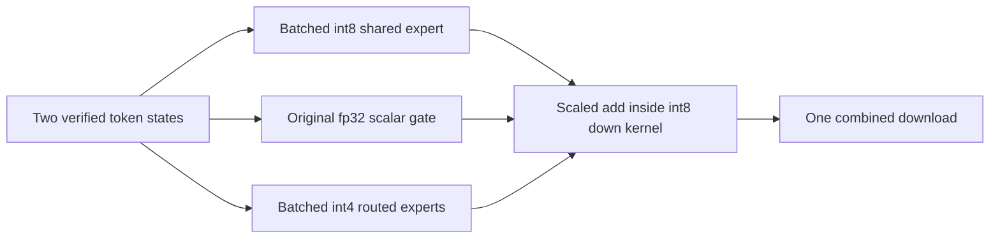

# Phase 6 Experiment 6: Batched Int8 Shared Expert and Gate Closure

**Project:** colib
**Model:** Qwen3.5-35B-A3B
**Hardware:** AMD Ryzen 7 7700X and NVIDIA GeForce RTX 5070 Ti 16 GB
**Date:** 25 July 2026
**Status:** Complete; Gate 6 passed

## Abstract

Experiment 5 identified mixture-of-experts (MoE) computation as 57.6% of
classified accepted-block verification. CUDA event timing then exposed a
format-dependent omission: routed experts were batched as grouped int4, but
the checkpoint's int8 shared expert still executed once per token. This study
adds a batched int8 matrix kernel, batches the shared gate/up/SiLU/down
sequence, and fuses its scaled result into the routed output.

The new path is bit-identical to the former per-token path. A standalone CUDA
test has maximum difference zero, and 320 comparisons covering 40 layers,
warmup, and measured generation also have maximum difference zero. In the
instrumented workload, MoE time fell from 1.021 to 0.816 seconds.

Three uninstrumented, alternating baseline/speculative pairs produced D0
throughputs of 29.47, 31.07, and 29.17 tokens per second and D1 throughputs of
41.08, 40.86, and 41.28. Their medians are 29.47 and 41.08 tokens per second,
or 1.394-fold. D1 exceeds the fixed 40.29-token-per-second threshold, so Gate
6 is closed.

## 1. Research question

Can the accepted target-verification path exceed 1.3 times matched
non-speculative throughput without changing any layer output?

The specific hypothesis was that repeated execution and synchronization of the
shared expert, rather than routed-expert arithmetic alone, consumed enough
time to explain the remaining approximately 0.214-second gate deficit.

An **expert** is a small feed-forward neural network selected by the router.
The **routed experts** process only selected tokens. The **shared expert**
processes every token, so its weights have perfect reuse within a speculative
block.

## 2. Method

### 2.1 Stage instrumentation

Nine CUDA events delimit eight intervals in each batched MoE transaction:

1. setup;
2. routed gate/up projection and SiLU;
3. routed down projection;
4. route-weight reduction;
5. shared gate/up projection and SiLU;
6. shared scalar-gate transfer;
7. shared down projection and accumulation;
8. final result download.

`coli_cuda_profile_reset` synchronizes and clears the counters after warmup.
The emitted transaction count therefore describes measured generation only.

### 2.2 Format audit

The converted container uses:

- grouped int4 for routed expert gate/up/down matrices;
- int8 for shared expert gate/up/down matrices;
- fp32 for the one-row shared-expert gating matrix.

The previous batch eligibility test required all four shared matrices to use
grouped int4. It could never select the shared batch path for this checkpoint.
After the routed batch completed, three int8 matrix operations and a
synchronization were therefore repeated for each verified token.

### 2.3 Implementation

The retained implementation adds:

- a two-dimensional int8 GEMM kernel with one warp per output row and sample;
- batched int8 shared gate and up projections;
- one batched SiLU-times-up activation;
- an int8 down-projection kernel that applies the precomputed shared scale and
  adds directly to the routed result;
- one final device-to-host result transfer for the combined MoE output.

The fp32 scalar gate remains calculated on the CPU in the original summation
order. Its stable sigmoid result is transferred as at most eight fp32 values.
This avoids changing gate arithmetic.



### 2.4 Controls

The fixed gate workload used:

- `Hello` rendered through ChatML;
- 64 warmup and 64 measured tokens;
- eight CPU threads;
- 8 GiB CUDA expert cache and 64 resident CPU expert slots per layer;
- depth 1, `MTP_MIN_MARGIN=2`;
- exact greedy decoding;
- alternating D0/D1 process order in the second pair;
- identical D0 and D1 token IDs as a mandatory condition.

The fixed target was retained from Experiment 4:

\[
1.3 \times 30.99 = 40.29\ \text{tokens per second}.
\]

## 3. Correctness results

| Check | Comparisons | Maximum difference | Result |
|---|---:|---:|---|
| standalone batched int8 shared expert | 2 × 1,026 outputs | 0 | pass |
| real-model layer checker | 320 layer blocks | 0 | pass |
| three gate continuation pairs | 3 × 64 token IDs | 0 mismatches | pass |

The layer checker recomputes every batched MoE output through the established
per-token route and compares all 2,048 hidden values. This establishes local
arithmetic identity rather than relying only on equal final tokens.

Regression evidence after the change:

- 13 C tests pass;
- 13 Python tests pass;
- standalone CUDA kernels pass, including the new q8 shared batch;
- tokenizer encode and decode parity remains 10,000/10,000;
- the delivered `c/qwen` binary is linked to CUDA 12.

## 4. Performance results

### 4.1 Instrumented attribution

Before shared batching, the representative decode took 1.841 seconds at 34.76
tokens per second and attributed 1.021 seconds to MoE. That first event trace
also showed that the nominal shared intervals were empty, which led to the
format audit.

After the final fused int8 path, one event-instrumented run measured:

| GPU interval | Time |
|---|---:|
| setup | 27.3 ms |
| routed hidden | 162.8 ms |
| routed down | 121.1 ms |
| route reduction | 4.8 ms |
| shared hidden | 21.0 ms |
| shared scale | 5.2 ms |
| shared down and accumulation | 12.3 ms |
| download and synchronization | 121.3 ms |

The 1,200 recorded transactions are measured generation only. Total
wall-attributed MoE time fell to 0.816 seconds, a reduction of 0.205 seconds
or 20.1%. CUDA events add overhead, so gate throughput was measured separately
without them.

### 4.2 Official gate pairs

| Pair | Order | D0 tok/s | D1 tok/s | Ratio | Exact IDs |
|---:|---|---:|---:|---:|---|
| 1 | D0 → D1 | 29.47 | 41.08 | 1.394 | yes |
| 2 | D1 → D0 | 31.07 | 40.86 | 1.315 | yes |
| 3 | D0 → D1 | 29.17 | 41.28 | 1.415 | yes |
| **median** | — | **29.47** | **41.08** | **1.394** | **yes** |

Every D1 run admitted and accepted 30 proposals and conservatively skipped
four low-margin proposals. Replay remained zero.

```mermaid
xychart-beta
    title "Gate 6 throughput by pair"
    x-axis ["Pair 1", "Pair 2", "Pair 3"]
    y-axis "tokens/s" 0 --> 45
    bar [29.47, 31.07, 29.17]
    bar [41.08, 40.86, 41.28]
    line [40.29, 40.29, 40.29]
```



The speculative median is 0.79 tokens per second, or 1.9%, above the fixed
absolute target. Its matched median ratio is 1.394, above the required 1.3.

## 5. Interpretation

The result supports the hypothesis. The shared expert is smaller than the
combined routed experts, but the previous implementation paid its GPU launch,
transfer, and synchronization costs once per token. Speculative verification
creates exactly the small batch over which a shared expert should reuse its
weights.

The decisive change was format-aware scheduling. A general “shared expert is
already fused” assumption was false because the model deliberately uses
different quantization formats for shared and routed experts. Event timing,
container inspection, and source-path inspection were all necessary to expose
the omission.

## 6. Threats to validity

- The formal performance gate uses one short prompt and 64 measured tokens.
- Consumer-GPU clocks and WSL background activity contribute visible variance.
- The kernel is tuned for batches of two to eight and was measured at depth 1.
- Multi-domain throughput was measured before this final kernel and should be
  repeated as a Phase-7 regression, not used to redefine the closed gate.
- Results apply directly to the RTX 5070 Ti; other GPUs retain the exact
  `CUDA_SPEC_MOE_BATCH=0` fallback and require their own tuning.

## 7. Decision

Retain the batched int8 shared-expert kernel and the fused scaled down
projection. Retain:

- `CUDA_SPEC_MOE_BATCH=0` as the exact per-token fallback;
- `CUDA_PROFILE_STAGES=1` for device-specific diagnosis;
- the full-layer `CUDA_SPEC_MOE_CHECK=1` validator.

Gate 6 is passed. Phase 7 may begin with the 397B conversion and resource-plan
preflight.

## 8. Reproduction

```sh
make -C c CUDA=1 CUDA_ARCH=sm_120 qwen test-cuda

python3 c/tools/bench_mtp_domains.py \
  --gate-hello --depth 0 --depth 1 \
  --mtp-min-margin 2 \
  --output c/bench/mtp_gate_q8_pair1.json

CUDA_PROFILE_STAGES=1 python3 c/tools/bench_mtp_domains.py \
  --gate-hello --depth 1 --mtp-min-margin 2 \
  --output c/bench/mtp_moe_stage_profile_q8_fused_kernel.json
```

The three gate artifacts are
`c/bench/mtp_gate_q8_pair{1,2,3}.json`. Exact layer evidence is in
`c/bench/mtp_q8_shared_fused_kernel_check.json`.
