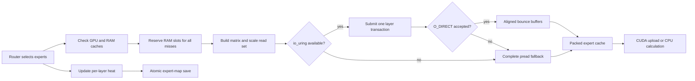

# Phase 7 Experiment 5: Batched Direct Storage and a Learning Expert Cache

**Project:** colib
**Model under test:** deterministic Qwen3.5 tiny int4 fixture
**Target model:** Qwen3.5-397B-A17B
**Host storage path:** WSL2 Linux filesystem
**Report date:** 25 July 2026
**Status:** mechanism validated; full-model throughput not yet measured

## Abstract

The 397B model contains far more mixture-of-experts weights than can remain in
GPU memory or main memory. Consequently, inference must retrieve some expert
weights from solid-state storage. A single routed expert is represented by
three matrices and three scale arrays. The original runtime loaded these six
objects mostly in sequence. This experiment introduced an optional Linux
storage pipeline that groups the missing experts of one layer into a single
`io_uring` transaction, uses aligned `O_DIRECT` reads to bypass duplicate page
cache residency, and falls back to ordinary positioned reads if either feature
is unavailable. It also persists per-layer expert-use frequencies so later
runs can preload experts that were frequently selected in earlier runs.

On the tiny int4 fixture, the new path retained exact 32/32 teacher-forced and
32/32 greedy token agreement. With a deliberately restricted two-expert cache,
498 misses generated 3,048 individual tensor reads. Grouping reduced storage
submissions from 508 transactions in the single-expert implementation to 342
transactions, a 32.7% reduction, while all 0.009 GiB of measured tensor traffic
used direct I/O with zero fallbacks. A second process loaded and atomically
rewrote the learned expert map. These results validate the mechanism and its
instrumentation, but do not establish the Gate-7 requirement of at least two
tokens per second; that measurement requires the completed 397B container.

## 1. Research question

Can colib reduce the submission overhead and memory duplication of cold expert
loads while preserving numerical output and retaining portable fallbacks?

The hypothesis was that a layer-level batch would reduce the number of storage
transactions without changing tensor bytes. A second hypothesis was that a
persistent heat map would provide a reproducible starting point for later
cache-warm experiments.

## 2. Technical background

A **mixture-of-experts (MoE)** layer owns many alternative feed-forward
networks, called experts. A router selects only a small number for each token.
Qwen3.5-397B selects ten experts per routed layer, so the full expert collection
does not need to be read for every token. However, an expert that is absent from
the RAM and VRAM caches becomes a storage miss.

`io_uring` is a Linux interface that submits a group of input/output operations
to the kernel and later receives their completion records. `O_DIRECT` asks the
filesystem to transfer data without first retaining another copy in the
operating-system page cache. Direct I/O requires aligned offsets, lengths, and
memory buffers. Safetensors entries are not generally aligned, so colib reads
the enclosing 4 KiB region into an aligned temporary buffer and copies only the
requested tensor bytes.

An **expert heat map** is a table indexed by layer and expert. Each route raises
the relevant count. On a later run, `AUTOPIN=1` selects the highest-count
experts as the initial RAM residents. The file is replaced atomically only
after its complete contents have been flushed.

## 3. Method

The implementation added three independently observable controls:

- `PIPE=1` groups all currently missing experts in a layer;
- `URING=1` submits each group through `io_uring`;
- `DIRECT=1` uses aligned direct reads where supported.

Every unsuccessful optional operation replays the same request through the
existing complete-`pread` loop. Telemetry separates logical bytes, direct
bytes, direct fallbacks, ring batches, ring reads, and ring fallbacks.

The expert map is enabled by `AUTOPIN=1`. `EMAP_PATH` can place it outside the
model directory. Its header records a magic value, version, layer count, and
expert count; an incompatible map is ignored rather than interpreted.

The data flow is:



The controlled correctness run used:

```text
SNAP=c/qwen_tiny_i4
REF=c/ref_qwen_i4.json
TF=1 MTP=0 EXPERT_RAM=2
PIPE=1 URING=1 DIRECT=1
```

The two-slot limit intentionally forced repeated eviction and retrieval. A
second two-run test additionally used `AUTOPIN=1` and a temporary
`EMAP_PATH`. The standalone CUDA run enabled the same storage controls with
int4/fp16 execution and a 0.01 GiB expert VRAM cache.

## 4. Results

| Observation | Result |
|---|---:|
| Teacher-forced token agreement | 32/32 |
| Greedy token agreement | 32/32 |
| CPU tier hits | 242 |
| CPU tier misses | 498 |
| Logical expert traffic | 0.009 GiB |
| Direct-I/O traffic | 0.009 GiB |
| Direct-I/O fallbacks | 0 |
| Tensor read completions | 3,048 |
| Ring batches before layer grouping | 508 |
| Ring batches after layer grouping | 342 |
| Ring-batch reduction | 32.7% |

The expert-map integration test reported `loaded=0 saved=1` on the first
process and `loaded=1 saved=1` on the second. The CUDA oracle also remained
32/32 in both modes. Its small expert VRAM cache converted most later routes
into GPU hits: 700 GPU hits, two CPU hits, and 38 RAM misses, for a reported
94.86% combined hit rate.

The regression suite increased to 14 C tests and 23 Python tests. Both suites
passed after the storage and persistence changes, as did the independent CUDA
kernel test.

## 5. Interpretation

The transaction count did not fall by a factor of two because some requested
experts were already resident and a one-miss group still needs one
transaction. Nevertheless, the result verifies that simultaneous misses are
now combined. The benefit should be larger for Qwen3.5-397B because its router
selects ten experts rather than the tiny fixture's two.

Direct I/O removes page-cache duplication only for the copied-cache mode.
Memory-mapped expert views remain a separate fallback and are disabled when
the explicit pipeline is selected. This distinction matters for the RAM guard:
the planned 18 GiB expert budget should correspond to owned packed buffers,
not to an uncontrolled collection of mapped file pages.

The persistent map establishes a mechanism for an expert-atlas warm-up. It
does not prove that routing distributions remain stable across unrelated
prompts. Gate 7 must therefore report both a cold run and a realistic
same-workload warm run rather than presenting only the best cached result.

## 6. Limitations

The tiny fixture reads only megabytes and cannot measure sustained NVMe
bandwidth. Its two-expert routing topology also understates the opportunity for
batching ten misses. WSL2 storage behavior may differ from native Linux and
from another SSD. Finally, the current map records frequency and recency
evidence but does not yet contain a representative 397B route atlas.

## 7. Engineering decision

Retain the layer-batched storage pipeline, direct-I/O fallback, telemetry, and
atomic expert map. The next experiment will use the completed 397B container
to measure:

1. cold logical bytes per token and storage bandwidth;
2. cache hit rate after an atlas-style warm-up;
3. decode throughput under the approved 18 GiB RAM and 6 GiB VRAM budgets;
4. coherent generation and a small perplexity sanity check.

The ≥2 tokens/s criterion remains open until those full-model measurements
pass.
