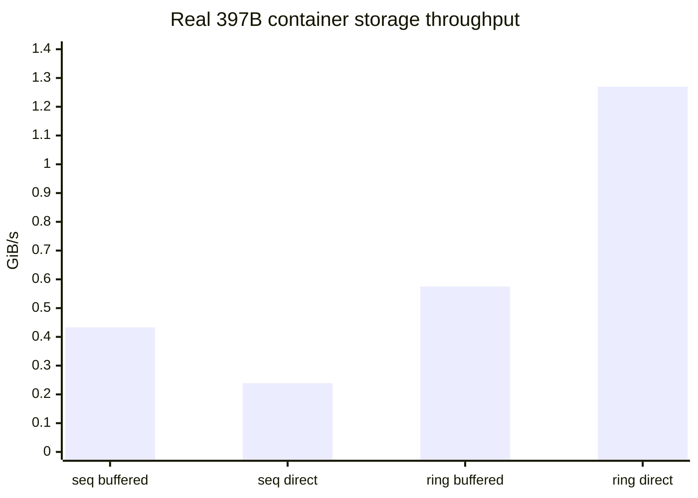

# Phase 7 Experiment 6: Storage Throughput on Real 397B Expert Payloads

**Project:** colib
**Data:** committed Qwen3.5-397B converted shards
**Storage:** WSL2 project filesystem
**Report date:** 25 July 2026
**Status:** provisional measurement during concurrent conversion

## Abstract

Experiment 5 validated the storage mechanism on a tiny model. Experiment 6
measured it against actual grouped-int4 tensors already committed by the
Qwen397 production converter. The benchmark read 20 real routed-expert
matrices and their 20 scale arrays per transaction, repeated eight times for
0.332 GiB of logical traffic. All variants produced the same checksum.

Sequential buffered reads reached 0.433 GiB/s, sequential direct reads reached
0.239 GiB/s, buffered `io_uring` reached 0.575 GiB/s, and direct `io_uring`
reached 1.244–1.270 GiB/s in two short repetitions. A longer direct-ring run
overlapped the active checkpoint converter and fell to 0.662 GiB/s. Thus the
batched direct path is retained, but these results revise an earlier Gate-7
assumption: at the observed bandwidth, a four-GiB cold token requires roughly
83–91% non-disk expert hits to sustain two tokens/s before compute time is
included. The previous 40–50% estimate is withdrawn.

## 1. Research question

Does the optional storage path improve throughput on real 397B container
objects, and what cache-hit rate follows from the measured bandwidth?

## 2. Method

The production conversion was intentionally left running. This prevented the
benchmark from claiming an unrealistically isolated storage result and exposed
contention, but it also makes the numbers provisional.

`bench_tier_io.c` indexed the partial converted snapshot with the same
safetensors reader used by inference. It selected the first 20 available
routed-expert payloads and their `.qs` scale tensors. These committed shards
currently contain gate and up projections; later down projections have the
same container representation. Each run performed eight complete transactions
and advised the operating system to discard buffered pages after use.

The four controls were:

| Variant | `URING` | `DIRECT` |
|---|---:|---:|
| Sequential buffered | 0 | 0 |
| Sequential direct | 0 | 1 |
| Batched buffered | 1 | 0 |
| Batched direct | 1 | 1 |

Every run read 40 tensor entries per transaction, 0.332 GiB over eight
transactions, and returned checksum `13798730707824525806`.

## 3. Results

| Storage path | Throughput (GiB/s) |
|---|---:|
| Sequential buffered | 0.433 |
| Sequential direct | 0.239 |
| Batched buffered `io_uring` | 0.575 |
| Batched direct `io_uring`, short run 1 | 1.270 |
| Batched direct `io_uring`, short run 2 | 1.244 |
| Batched direct `io_uring`, longer contended run | 0.662 |

No direct or ring fallback occurred. Batched direct I/O was 5.2 times faster
than sequential direct I/O in the controlled eight-transaction comparison.
Sequential direct I/O was slower than buffered reads because it paid alignment
and submission costs without concurrency.

## 4. Cache-hit implication

The cold route estimate is approximately:

\[
60\ \text{layers} \times 10\ \text{experts} \times
6.684675\ \text{MB} = 4.010805\ \text{GB/token}
\approx 3.735\ \text{GiB/token}.
\]

At two tokens/s, storage has at most half a second per token. If storage
bandwidth is \(B\) GiB/s and the non-disk hit fraction is \(h\), a necessary
condition is:

\[
3.735(1-h) \le \frac{B}{2}.
\]

This gives:

| Assumed sustained bandwidth | Necessary non-disk hit rate |
|---|---:|
| 0.662 GiB/s | 91.1% |
| 1.244 GiB/s | 83.3% |
| 1.270 GiB/s | 83.0% |
| 2.3 GiB/s earlier isolated device result | 69.2% |

These are lower bounds because CUDA upload and model calculation also consume
time. The gate should therefore seek an operational 85–92% warmed disk-avoidance
rate on the current host, then judge the actual end-to-end token rate.

## 5. Interpretation

The experiment supports concurrency, not direct I/O in isolation. `O_DIRECT`
prevents a second cache copy, while `io_uring` supplies the queue depth needed
to keep storage busy. Enabling one without the other can be slower.

The more important result is the corrected cache requirement. The 18 GiB RAM
cache and 6 GiB VRAM cache cannot cover experts uniformly; success depends on a
highly concentrated routing distribution and an atlas warm-up representative
of the measured chat workload. If the full model cannot reach the revised hit
rate, the honest remedies are a larger host cache, a faster storage device, or
a lower throughput claim—not a relaxed telemetry interpretation.

## 6. Limitations

The conversion process simultaneously downloaded, decoded, quantized, and
wrote large shards. The longer run demonstrates this contention but does not
measure isolated steady state. The partial snapshot supplied gate and up
matrices rather than complete three-matrix experts. Finally, synthetic repeated
reads do not reproduce route locality.

## 7. Engineering decision

Retain `PIPE=1 URING=1 DIRECT=1` as the Gate-7 candidate. Re-run this benchmark
after conversion completes, construct a prompt-derived expert atlas, and
require `[TIERS]` to report the revised warmed hit rate alongside end-to-end
throughput.
