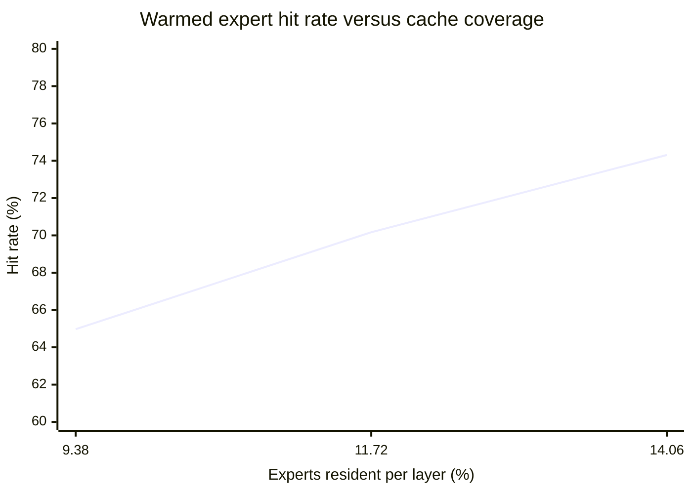

# Phase 7 Experiment 7: Equivalent-Capacity Cache Locality Proxy

**Project:** colib
**Model:** Qwen3.5-35B-A3B
**Purpose:** estimate 397B expert-cache locality before conversion completes
**Report date:** 25 July 2026
**Status:** controlled proxy; not a Gate-7 certification

## Abstract

The proposed Qwen397 runtime can hold only a small fraction of its 512 routed
experts at each layer. This experiment configured Qwen35 with comparable
per-layer cache fractions and measured warmed routed-expert hits, disk reads,
and end-to-end decoding. Increasing capacity from 24 to 36 of 256 experts
raised the warmed hit rate from 64.97% to 74.31% and throughput from 3.42 to
9.00 tokens/s. All three runs emitted identical token sequences.

The corrected Qwen397 resource plan provides 48 host slots per layer and an
average of 16.05 device slots per layer: at most 64.05 of 512 experts, or
12.51% nominal coverage. Interpolation from the Qwen35 controls suggests
approximately 71–73% warmed hits. That is below the 83–91% necessary
disk-avoidance range inferred from the concurrently measured storage
bandwidth. The result does not prove Gate 7 will fail, because routing
distributions differ by model and host/device cache overlap is dynamic. It
does show that the gate must not assume its throughput target from cache
capacity alone.

## 1. Research question

At cache fractions close to the Qwen397 Gate-7 resource plan, how much
expert-route locality does the already validated Qwen35 model exhibit?

## 2. Method

The experiment used the converted Qwen35 snapshot, the same prompt and greedy
decoder in every run, 64 warm-up tokens, and 64 measured tokens. The
layer-local host cache was varied while direct storage, batched loading, and
the persistent heat map were enabled. The first run included cold dense-load
effects; the later runs reused mapped dense weights and the saved heat map.
Therefore hit rates and token identity are the primary observations, while
the throughput values describe the complete configurations rather than an
isolated cache-size treatment.

Qwen35 has 256 experts. Cache capacities of 24, 30, and 36 experts per layer
correspond to 9.38%, 11.72%, and 14.06% coverage. These bracket Qwen397's
nominal 12.51% combined host/device capacity.

## 3. Results

| Qwen35 cache slots/layer | Coverage | Hits | Misses | Warmed hit rate | Decode rate |
|---:|---:|---:|---:|---:|---:|
| 24 | 9.38% | 13,097 | 7,063 | 64.97% | 3.42 tok/s |
| 30 | 11.72% | 14,146 | 6,014 | 70.17% | 8.01 tok/s |
| 36 | 14.06% | 14,981 | 5,179 | 74.31% | 9.00 tok/s |

All emitted token IDs were identical across the three runs. The 24-slot run
read 10.993 GiB of expert payloads during the measured interval.

Linear interpolation between the 30- and 36-slot controls places 12.51%
coverage near a 71.6% hit rate. Reporting a 71–73% band is more appropriate
than a point prediction because Qwen397's CUDA cache is global, its slots may
overlap the host tier, and its routing distribution is unknown.

## 4. Storage implication

Qwen397's cold expert traffic is 3.735 GiB/token. At a 71.6% hit rate, the
remaining disk traffic is approximately:

\[
3.735(1-0.716)=1.06\ \text{GiB/token}.
\]

Even at an isolated 2.3 GiB/s storage rate, this consumes about 0.46 seconds
per token. A two-token/s budget is 0.50 seconds, leaving only about 0.04
seconds for routing, CUDA upload, dense kernels, synchronization, and token
sampling. At the 1.244–1.270 GiB/s rates observed during conversion, storage
alone exceeds the budget.

This calculation is a necessary-condition analysis. I/O and compute can
overlap, and repeated routes may already reside in the device tier. Conversely,
host/device overlap can make the nominal 12.51% coverage optimistic.

## 5. Interpretation

The cache is useful—the hit rate is far larger than uniform random coverage—
but the observed locality is not strong enough to make the throughput target
automatic. Three engineering routes remain scientifically defensible:

1. measure a more representative 397B routing atlas and exploit
   prompt-to-prompt persistence;
2. overlap predictive expert reads with the preceding attention/GDN work;
3. enlarge effective host capacity by reducing retained dense-host residency
   or moving to a larger-memory deployment.

Increasing `RAM_GB` immediately is not selected. The corrected plan already
requires 26.20 of the observed 29.38 GiB physical RAM, leaving 3.18 GiB of
calculated margin.

## 6. Limitations

Qwen35 and Qwen397 do not necessarily share expert popularity, transition
probabilities, or layer correlations. The device tier was represented as an
equivalent capacity rather than reproducing its global eviction policy. The
throughput controls also differ in dense-loading mode, so they should not be
used to attribute all speedup to cache size.

## 7. Engineering decision

Retain the safe 18 GiB RAM and 6 GiB CUDA cache profile for the first complete
397B measurement. Treat 71–73% as a risk estimate, not a release claim.
Gate 7 closes only from full-model token identity, actual `[TIERS]` telemetry,
and sustained warmed throughput. If the miss rate remains above the measured
storage envelope, implement read/compute overlap before changing the target.
