# Phase 7 Experiment 8: Predictive Expert I/O Overlap

**Project:** colib
**Control model:** Qwen3.5-35B-A3B
**Storage condition:** concurrent Qwen397 conversion
**Report date:** 25 July 2026
**Status:** unfiltered policy rejected; mechanism retained opt-in

## Abstract

Direct `io_uring` makes expert reads concurrent within a layer, but routing is
known only after that layer's attention/GDN calculation. This experiment
tested whether learned route transitions could move reads earlier and overlap
them with dense computation. The implementation records per-layer
previous-to-next expert co-occurrences, batch-loads likely absent experts on a
worker thread, and waits at the MoE boundary before using cache pointers.

A stressed tiny-model test first exposed and then verified the repair of a
late-worker eviction race. With the completion barrier, fp32/int4 oracle
predictions remained exact. On Qwen35, however, unfiltered top-four prefetch
had only 12.85% precision. It raised physical reads from 10.305 to 25.822 GiB
and slowed decode from 1.86 to 1.50 tokens/s. The policy is rejected for the
initial 397B gate.

## 1. Hypothesis

If consecutive tokens have predictable routed-expert transitions, loading
likely misses while attention/GDN runs should reduce exposed storage latency:

```mermaid
gantt
    title Intended overlap within one decoder layer
    dateFormat X
    axisFormat %L
    section Main thread
    Attention or GDN :a, 0, 10
    MoE computation  :b, 10, 18
    section I/O worker
    Predicted expert batch :p, 0, 10
```

The optimization is beneficial only when the saved stall time exceeds the
cost of incorrect reads and cache pollution.

## 2. Safety mechanism

The first tiny-model implementation allowed a queued worker to start after the
main thread had already selected expert pointers. The worker could then evict
one of those slots during matrix multiplication, producing 21/32 greedy
matches. A per-layer condition variable now establishes this rule:

1. submit the predicted batch before attention/GDN;
2. allow cache mutation concurrently with dense computation;
3. wait at the MoE boundary until the batch completes;
4. select and consume expert pointers only after the barrier.

The repaired configuration passes 32/32 teacher-forced and 32/32 greedy
checks. Prefetch loads, useful predictions, and evicted-before-use predictions
have counters separate from actual route hits and misses, preventing the
optimization from inflating cache-hit telemetry.

## 3. Method

The A/B used Qwen35 with 30 host experts per layer, 64 warm-up tokens, 64
measured greedy tokens, mapped dense weights, batched direct `io_uring`, CUDA
dense kernels, and CUDA expert caching disabled to isolate storage behavior.
The active Qwen397 converter was intentionally left running in both arms.

The control disabled predictive loads. The treatment selected the four
highest-scoring nonresident experts from the route-transition table at each
layer. Both runs loaded the same saved heat map and emitted the same 64 token
IDs.

## 4. Results

| Measure | Control | Top-four prefetch | Change |
|---|---:|---:|---:|
| decode time | 34.359 s | 42.797 s | +24.6% |
| decode rate | 1.86 tok/s | 1.50 tok/s | −19.4% |
| actual route hit rate | 67.16% | 67.70% | +0.54 points |
| storage reads | 10.305 GiB | 25.822 GiB | +150.6% |
| predicted loads | 0 | 10,080 | — |
| useful predicted loads | 0 | 1,295 | — |
| evicted before use | 0 | 8,760 | — |
| prediction precision | — | 12.85% | — |

Twenty-five predicted experts remained resident at exit, accounting for the
difference between loads and the sum of useful and wasted predictions.

## 5. Interpretation

The overlap mechanism works, but the tested predictor does not. Extra reads
more than doubled storage traffic, and their cache pollution erased the small
gain in actual hit rate. Identical tokens demonstrate functional safety, not
performance value.

The code now allocates transition tables only when `PREFETCH_LOAD=1`, limits
prefetch to capacity beyond the routed top-k, defaults to two candidates, and
requires an empirical inclusion confidence of 0.5 unless
`PREFETCH_MIN_CONF` overrides it. These safeguards make later sweeps possible
without enabling the failed policy by default.

## 6. Limitations

The control model is smaller than Qwen397, the storage device was contended,
and one prompt cannot estimate cross-domain transition stability. CUDA expert
caching was disabled deliberately, so the result isolates host/storage
behavior rather than the complete Gate-7 hierarchy.

## 7. Decision

Run the first complete Qwen397 gate with `PREFETCH_LOAD=0`. Do not claim
read/compute overlap as a throughput remedy. If the full route trace justifies
another experiment, sweep confidence thresholds against replayed routes and
require fewer bytes read as well as lower end-to-end decode time.
