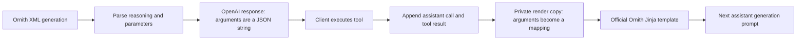

# Phase 8 Experiment 2: OpenAI-to-Ornith Tool History Round Trip

**Project:** colib
**Protocol:** released Ornith Qwen3 XML and OpenAI chat tool calls
**Official template:** Ornith-1.0-35B-FP8 pinned metadata
**Report date:** 25 July 2026
**Status:** protocol round trip complete; model-generation gate pending

## Abstract

Ornith emits Qwen3-style XML tool calls, while an OpenAI-compatible server
returns `function.arguments` as a JSON string. The released Ornith Jinja
template expects those arguments to be a mapping when an assistant call is
inserted back into conversation history. Directly replaying the OpenAI object
therefore fails during rendering.

This experiment adds a boundary normalization that parses argument strings
only in the private copy sent to Jinja. The public response remains compliant
with the OpenAI wire format. A seven-test protocol suite now covers parsing,
reasoning separation, invalid JSON, synthetic rendering, dual stop-token
metadata, and a complete official-template call/result/continuation round
trip. This closes the history-format mechanism but not Gate 8, which still
requires an actual Ornith-35B generation to choose and populate a tool call.

## 1. Data flow

The mapping conversion occurs only on edge \(F\). Mutating the public response
would make the server non-conforming; passing the string directly to Jinja
would make multi-step tool use fail.

## 2. Method

`parse_assistant_response` was given an XML response containing reasoning and
a `get_weather(city="Paris")` call. Its OpenAI-style result was appended to a
user message and a JSON tool result. `render_chat` then rendered the sequence
with the pinned official 35B `chat_template.jinja`, the same template shipped
with the checkpoint.

The normalization performs a deep copy, restricts itself to assistant
`tool_calls`, parses only string-valued `function.arguments`, and requires the
decoded value to be a JSON object. Invalid JSON and non-object values raise an
explicit `ValueError` before template execution.

## 3. Results

The official template output contained all expected protocol elements:

- the declared `get_weather` function;
- `<parameter=city>` with `Paris`;
- the JSON value inside `<tool_response>`;
- a final `<|im_start|>assistant\n<think>\n` continuation prompt.

The original parsed response still held a string-valued arguments field after
rendering, demonstrating that normalization did not mutate the server object.
The live gateway and interactive CLI now dispatch through the snapshot family
marker; their Ornith rendering is byte-identical to the standalone official
template path. All seven focused protocol tests passed.

## 4. Interpretation

The failure was an interface mismatch, not a model or tokenizer defect. Both
representations are individually correct:

| Boundary | Required argument representation |
|---|---|
| OpenAI-compatible API response | JSON-encoded string |
| Ornith official Jinja history | mapping/object |

An explicit adapter at the rendering boundary is preferable to changing
either external contract.

## 5. Limitations

The XML in this experiment is deterministic fixture output. It proves that a
valid generated call can travel through the server-facing representation and
back into the official model prompt. It does not prove that the converted
Ornith model selects the correct tool, generates valid parameter values, or
terminates at the expected end token.

## 6. Gate consequence

Retain the official-template round trip as a regression test. After
Ornith-35B conversion, Gate 8 must run a deterministic tool-selection prompt,
execute the named fixture tool, render the returned value, and verify a final
natural-language answer with clean EOS termination.
