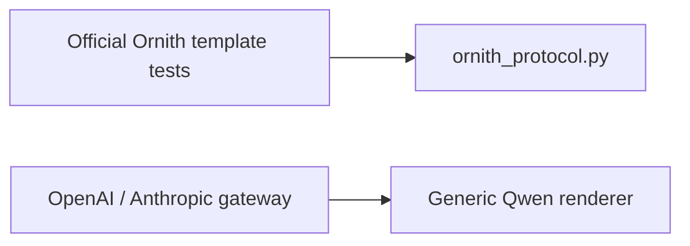
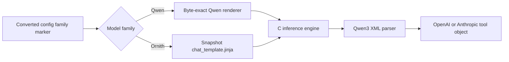

# Phase 8 Preflight 3: End-to-End Ornith Tool Gate

## Abstract

The Ornith protocol parser and official Jinja history round trip were already
correct in isolation, but inspection showed that the live gateway and
interactive CLI still called the generic Qwen renderer unconditionally. The
runtime surfaces now dispatch on the converter's explicit
`colib_model_family` marker. Ordinary Qwen retains its byte-exact manual
renderer; Ornith loads the `chat_template.jinja` stored beside that exact
snapshot.

This preflight also freezes an executable HTTP acceptance test for the first
converted Ornith-35B model. The test requires the model to choose a declared
weather function, provide the correct city argument, consume a deterministic
tool result, produce a final answer using that result, and terminate without
calling the tool again.

## 1. Integration correction

Before this change, the data flow stopped short of the production interface:



The corrected flow is:



The CLI uses the same dispatcher. The OpenAI wire representation remains
unchanged: function arguments are JSON strings in responses and become
objects only in the private copy sent back through Ornith's Jinja template.

For `tool_choice=required` or a named function, the dispatcher adds an
explicit system instruction and, for a named choice, filters the declarations
to that function. `tool_choice=none` removes tool declarations from the
rendered prompt.

## 2. Frozen end-to-end method

`c/tools/qualify_ornith_tools.py` launches the real gateway and engine on an
ephemeral loopback port. The first request declares:

```text
get_weather(city: string)
```

and asks for current weather in Paris with `tool_choice=required`. Acceptance
requires exactly one parsed call named `get_weather` and a case-insensitive
city argument equal to `Paris`.
The harness refuses a missing/incomplete quantization manifest and embeds its
source revision/fingerprint, shard/tensor/byte totals, and precision choices
in the retained result.

The harness then supplies this deterministic result:

```json
{"city":"Paris","temperature_c":18,"condition":"clear"}
```

It replays the assistant call and tool result through the public OpenAI
endpoint with `tool_choice=none`. The final message must be non-empty, mention
18, contain no further tool call or raw XML marker, and finish with `stop`
rather than exhausting the token limit. The first response must finish with
`tool_calls`. Both HTTP responses, token usage,
gateway profiles, expert telemetry, and the bounded server-log tail are saved
as the experimental artifact. For the default CUDA run, `/profile` must also
report positive resident-layer/device-MoE activity, zero host-MoE fallback,
and positive router/logit transfer counts. This prevents a protocol pass from
silently exercising a different host compute path.

The first production run is:

```sh
.venv/bin/python c/tools/qualify_ornith_tools.py \
  --model c/ornith35 \
  --ram-gb 8 --ram-headroom-gb 1 \
  --cuda-expert-gb 6 --cuda-headroom-gb 1 \
  --output c/ornith35_tool_qualification.json
```

## 3. Controls

- greedy decoding (`temperature=0`, `top_p=1`);
- one KV slot and 4,096-token context;
- predictive expert prefetch disabled;
- one persistent server for call and continuation;
- actual HTTP request/response envelopes, not direct parser calls;
- snapshot-specific template selected only by explicit family metadata;
- clean EOS enforced by the C model's two registered stop IDs.

The tool result is intentionally synthetic. The experiment evaluates agent
protocol behavior, not weather accuracy.

## 4. Pre-result checks

The existing seven-test Ornith suite now proves that gateway dispatch is
byte-identical to direct rendering of the pinned official 35B template,
including an explicit required-tool instruction. The fourteen Qwen gateway
tests and four CLI tests still pass, showing that family selection does not
change the ordinary Qwen interface.

The full Python suite experienced one readiness-timeout failure only while the
397B converter saturated storage; the identical web/real-tiny test passed in
6.75 seconds when repeated alone. This contended timeout is not recorded as a
functional regression, and the complete clean release gate must be repeated
after conversion before a release tag.

## 5. Gate rule

Passing fixture parsing is not enough to close Gate 8. The generated 35B run
must satisfy every assertion in the HTTP harness, retain the response artifact
for review, and accompany the Phase-4-style numerical comparison against its
own reference. Ornith-397B then repeats the protocol through the tiered Gate-7
runtime.
