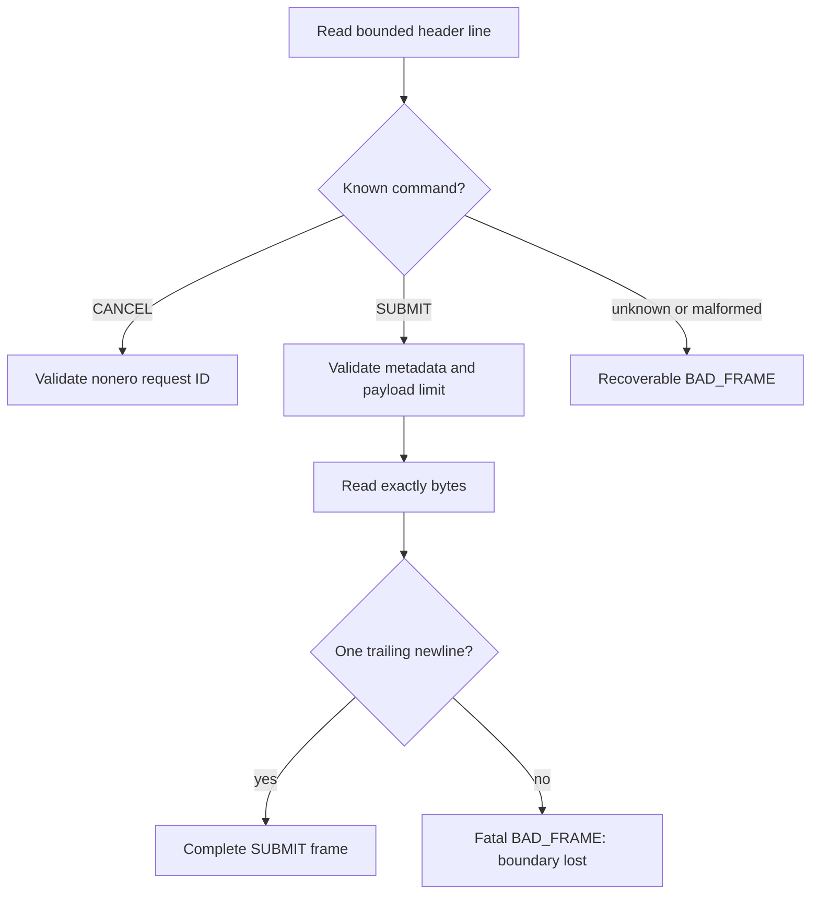

# Phase 9 Preflight 1: Mux Byte Framing

**Project:** colib
**Interface:** engine standard input/output
**Report date:** 25 July 2026
**Status:** transport primitive complete; scheduler integration pending

## Abstract

The Phase-9 server protocol combines line-shaped commands with prompts and
token pieces that may themselves contain newlines. A conventional
line-by-line parser cannot preserve those payloads. This preflight implements
a bounded C parser for `SUBMIT` and `CANCEL` plus byte-exact writers for
`READY`, `DATA`, `ERROR`, and `DONE`.

Tests demonstrate correct parsing of a 12-byte multiline prompt, recovery
after an unknown header, exact response bytes, and fatal rejection of
truncated or oversized payloads. The distinction between recoverable header
errors and fatal payload-boundary errors is necessary to prevent stream
desynchronization. Continuous batching, slot state, cancellation, and model
generation remain pending.

## 1. Frame model

The parser caps headers at 511 characters and prompt bodies at 16 MiB by
default. Callers may impose a lower body limit.

## 2. Validation rules

A `SUBMIT` frame requires:

- nonzero 64-bit request ID;
- nonnegative slot;
- nonempty payload within the configured limit;
- positive maximum-token count;
- nonnegative temperature;
- \(0 < \text{top\_p} \le 1\);
- no unexpected header fields;
- an exact payload length followed by one newline byte.

`CANCEL` accepts only a nonzero ID and no extra fields.

## 3. Error classification

| Failure | Recoverable? | Reason |
|---|---:|---|
| unknown command | yes | header newline provides next boundary |
| malformed numeric header | yes | header newline provides next boundary |
| overlong header | yes | parser drains to its newline |
| truncated body | no | next boundary is unknown |
| missing body terminator | no | body may have consumed later command bytes |
| declared body exceeds safety limit | no | safely skipping an untrusted length is not guaranteed |

This is a transport decision, not an HTTP status policy. A supervising server
can restart a connection-fatal engine process or pipe.

## 4. Tests

`test_serve_mux.c` uses temporary binary streams and checks:

1. `SUBMIT 42 3 12 ...` preserves `hello\nworld!`;
2. a bad header does not prevent the following `CANCEL 91`;
3. a three-byte body declared as five bytes fails fatally;
4. a 99-byte body under a 16-byte test limit fails fatally;
5. response framing matches the expected bytes, including a multiline
   three-byte `DATA` payload.

The test joins the normal C suite, increasing it from 14 to 15 binaries.

## 5. Limitations and next step

The primitive does not allocate KV slots, identify duplicate IDs, schedule
prefill/decode work, or persist recurrent state. It also does not yet switch
Windows CRT streams to binary mode. The next Phase-9 step is a deterministic
slot-state machine tested with a fake token-step callback before wiring model
state and continuous batching.
