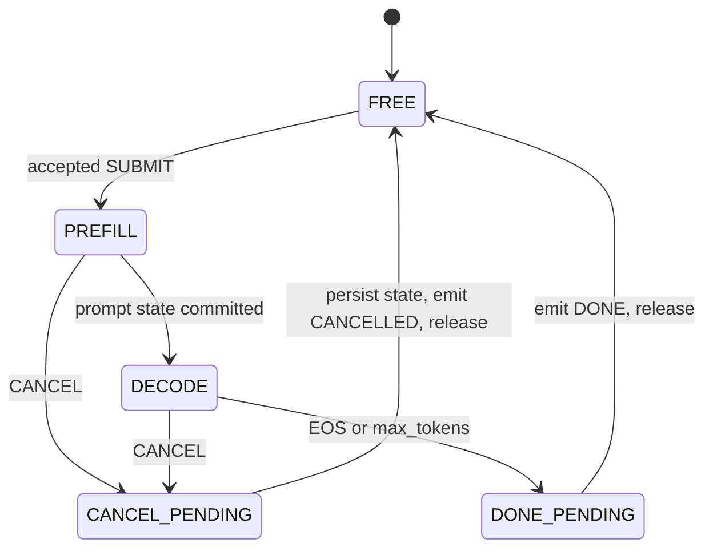

# Phase 9 Preflight 2: Slot Scheduler State

**Project:** colib
**Component:** continuous-batch request lifecycle
**Report date:** 25 July 2026
**Status:** deterministic state primitive complete; inference binding pending

## Abstract

Continuous batching combines independent requests in one decode step, so
transport correctness alone is insufficient. A scheduler must keep request
IDs unique, prevent concurrent ownership of a KV slot, remove cancelled and
length-complete work from decode batches, and prohibit slot reuse until state
has been persisted and the terminal response has been emitted.

This preflight implements a fixed-capacity 1–16-slot state machine and verifies
duplicate-ID rejection, busy-slot rejection, stable decode-row ordering,
prefill transitions, length completion, cancellation, terminal snapshots,
double-release rejection, and safe slot reuse. It deliberately contains no
model pointers, allowing the lifecycle contract to be tested without a 35B or
397B allocation.

## 1. State model

`CANCEL_PENDING` and `DONE_PENDING` are excluded from decode-row collection.
The scheduler does not automatically release them; the engine owns the
required persistence and response ordering.

## 2. Invariants

The tested scheduler maintains:

1. an in-flight ID appears in exactly one slot;
2. a non-free slot accepts no second request;
3. only `DECODE` slots appear in a model batch;
4. row order is increasing slot order and therefore deterministic;
5. reaching `max_tokens` immediately moves the request to `DONE_PENDING`;
6. a slot is reusable only after explicit release;
7. terminal statistics can be copied before release clears the slot.

These invariants separate client identity from model batch-row position. Batch
rows may change every step as requests finish, while slot indices remain the
owners of recurrent and KV state.

## 3. Error behavior

| Condition | Protocol code |
|---|---|
| invalid ID, slot, sampling range, or maximum length | `BAD_REQUEST` |
| ID already active in another or the same slot | `DUPLICATE_ID` |
| requested slot is not free | `SLOT_BUSY` |
| cancellation ID is unknown | `NOT_FOUND` |

Duplicate ID is checked before slot occupancy, making the error deterministic
when both conditions apply.

## 4. Test sequence

The test initializes three slots, submits requests 10 and 11, and confirms
that a repeated ID and a second owner of slot zero are rejected. Both requests
transition through prefill; decode rows are `[0, 1]`. Request 10 emits two
tokens and becomes done-pending. Request 11 is cancelled and becomes
cancel-pending. The decode batch then contains zero rows.

Terminal snapshots preserve request 10's two emitted and five prompt tokens
and request 11's cancellation state. A double release fails. A new request 12
then acquires the released slot zero, proving controlled reuse.

## 5. Limitations and next step

The state machine does not yet own token histories, recurrent matrices,
convolution tails, or KV buffers. EOS completion will use the same
done-pending transition but is not represented by a separate helper yet. The
next implementation step is a per-slot model-state container and exact
save/restore test on the tiny oracle, followed by connecting the framing and
scheduler primitives to `SERVE_BATCH=1`.
