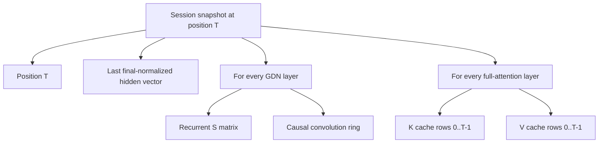

# Phase 9 Preflight 3: Hybrid Recurrent and KV Session State

**Project:** colib
**Model:** deterministic five-layer Qwen3.5 tiny oracle
**Report date:** 25 July 2026
**Status:** CPU and CUDA target-state restore exact; MTP transfer pending

## Abstract

Qwen3.5 is a hybrid recurrent/attention model. Reusing a chat session therefore
requires more than token history or a conventional KV cache: every Gated
DeltaNet layer also owns a recurrent matrix and causal-convolution tail. This
preflight implements an in-memory target snapshot containing those arrays, the
used portion of every full-attention KV cache, position, and the final
normalized hidden vector needed to reconstruct next-token logits. CUDA-active
models transfer authoritative device arrays explicitly.

The tiny model was prefetched to position 6, saved, advanced for eight greedy
tokens, restored, and advanced again. Both continuations were identical.
The snapshot held 40,960 recurrent fp32 scalars and 1,536 KV fp32 scalars.
The same test passes with CPU state and with CUDA-authoritative recurrence/KV,
using explicit device downloads and uploads. Two distinct sessions also
regenerate exactly while alternating every token, with byte-identical saved
state at each step. MTP-active snapshots still return failure rather than
saving incomplete drafter state.

## 1. Required state



The final hidden vector reconstructs boundary logits through the shared
language-model head. Storing the full vocabulary logits would be larger and
redundant.

## 2. Method

The test loads `qwen_tiny_i4` with MTP and prefetch threads disabled and all
four experts resident. It runs once on CPU and once with the CUDA dense,
expert, GDN, and GQA paths active. Each arm:

1. saves the target session at `pos=6`;
2. greedily generates eight token IDs;
3. restores the saved state;
4. recomputes boundary logits from `last_hidden`;
5. greedily generates the same number of IDs;
6. compares both sequences exactly.

The state object records configuration identity (`hidden`, layer count, KV
precision) and validates all derived scalar counts on restore. CUDA transfers
are serialized under the runtime lock; restore updates device positions only
after both state buffers upload successfully.

The A/B also exposed an authority rule: chunked prompt prefill advances GDN
state on the host even when CUDA auxiliary buffers already exist from an older
turn. Save downloads a device array only when its recorded device position
equals the model position; otherwise the host array is authoritative. Ignoring
this condition made alternating sessions diverge even though one-shot restore
appeared exact.

## 3. Result

```text
session recurrent+KV restore: exact pos=6 recurrent=40960 kv=1536
```

The test covers four recurrent GDN layers and one full-attention layer, so it
would fail if either state family were omitted. It joins the C regression
suite. A second check creates two different prompts and alternates
restore/decode/save on every token; CPU and CUDA both report
`two-slot alternating restore: exact state=exact`.

## 4. Correctness boundaries

The snapshot is accepted only when:

- MTP is disabled;
- position fits the configured context;
- hidden size, layer count, and KV precision match;
- recurrent and KV scalar counts match the current architecture.

CUDA GDN and GQA kernels retain authoritative state on device, while their
host arrays may be stale. Save therefore downloads those arrays directly and
restore updates both host fallbacks and device buffers. MTP adds a second
attention/MoE decoder position and state; silently persisting only the target
would still produce plausible but non-identical speculative behavior.

## 5. Limitations and next step

Token history is scheduler/server metadata and is not yet stored in the model
snapshot. The current object is in-memory only and reallocates to the used KV
length. Next, add an MTP state section and bind one validated `SessionState` to
each scheduler slot. Disk serialization and exact-extension prefix checks
follow only after in-memory multi-slot switching is exact.
