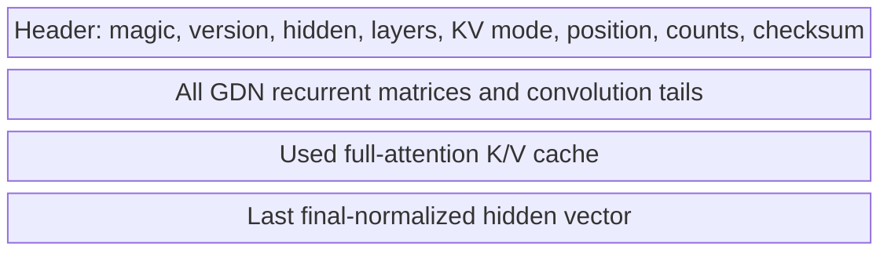

# Phase 9 Preflight 4: Atomic Disk Session Checkpoint

**Project:** colib
**Format version:** `COLISESS` v1
**Report date:** 25 July 2026
**Status:** local target-state reload exact; portable/MTP format pending

## Abstract

In-memory slot switching does not survive an engine restart. This preflight
serializes the validated target `SessionState` to a versioned local binary
file. The writer computes a payload checksum, flushes and `fsync`s a
process-specific temporary file, then atomically renames it over the target.
The reader validates format version, architecture dimensions, position,
derived recurrent/KV counts, complete file length, and checksum before the
state can reach the model.

The tiny hybrid model regenerates the same eight-token continuation after a
disk reload on both CPU and CUDA. Flipping the final payload bit makes the
reader reject the checkpoint. The result establishes crash-safe local storage
for the target model; it does not yet include token history or MTP drafter
state.

## 1. File structure



The header uses fixed-width integers and the payload uses the runtime's native
fp32 or BF16-KV representation. Version 1 is intentionally a same-build,
same-architecture checkpoint rather than a portable interchange format.

## 2. Write protocol

For destination `session.bin`, the writer:

1. validates scalar counts against `size_t` overflow;
2. computes a 64-bit FNV-1a checksum over recurrent state, KV, and last hidden;
3. writes `session.bin.tmp.<pid>`;
4. calls `fflush` and `fsync`;
5. closes the temporary file;
6. atomically renames it to `session.bin`;
7. `fsync`s the containing directory;
8. removes the temporary file on any pre-rename failure.

No partially written file is presented under the final name.

## 3. Read protocol

Before allocation, the reader requires:

- magic `COLISESS` and version 1;
- matching hidden size, layer count, and KV precision;
- position within configured context;
- recurrent scalar count equal to the current hybrid architecture;
- KV scalar count equal to the current number of full layers and saved
  position;
- counts that cannot overflow host allocation sizes.

After reading, it requires exact EOF and a matching checksum. Any failure
frees the partially constructed state.

## 4. Experiment

The existing position-6 tiny session was written to a unique `/tmp` path,
loaded into a fresh `SessionState`, restored, and decoded for eight greedy
tokens. The result matched the in-memory baseline on CPU and CUDA:

```text
session disk checkpoint: exact corruption=rejected
```

The test then toggled one bit in the final byte and confirmed that a second
read failed. The temporary test checkpoint was deleted.

## 5. Limitations and next step

Version 1 does not encode token history, tokenizer identity, byte order, model
revision hash, MTP state, or a cryptographic integrity/authenticity tag.
FNV-1a detects accidental corruption but is not a security primitive. Before
user-facing persistence, version 2 must add the immutable model/container
identity, token history for exact-extension checks, explicit little-endian
encoding, and an MTP section.
