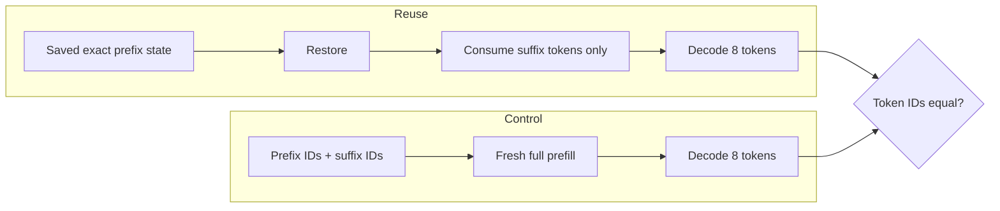

# Phase 9 Preflight 5: Exact-Extension Prefix Reuse

**Project:** colib
**Model:** deterministic Qwen3.5 tiny oracle
**Report date:** 25 July 2026
**Status:** model mechanism exact on CPU and CUDA; server detection pending

## Abstract

A persisted recurrent/KV snapshot is reusable only when the next rendered
prompt begins with exactly the token history represented by that snapshot.
This experiment saved a state after the oracle prompt and four generated
tokens, restored it, consumed a two-token suffix, and decoded eight more
tokens. A control discarded the snapshot and freshly prefetched the complete
concatenated history. Both continuations were identical on CPU and CUDA.

The result validates the model-side extension operation. It does not authorize
longest-common-prefix truncation: GDN recurrence cannot be rewound from an
arbitrary later snapshot. The server must compare complete token IDs and fall
back to full prefill on any mismatch.

## 1. Compared paths



## 2. Method

The test:

1. prefills the six-token oracle prompt;
2. generates and consumes four greedy tokens;
3. saves the hybrid target state and corresponding conceptual history;
4. restores the state;
5. consumes fixed extension IDs 17 and 18;
6. records eight greedy continuation IDs;
7. resets the model and prefills all 12 history IDs from scratch;
8. records and compares another eight-token continuation.

The complete procedure runs in the ordinary CPU test and in the CUDA session
test with device GDN/GQA state transfers enabled.

## 3. Result

Both backends report:

```text
exact-prefix extension reuse: exact
```

This is a token-exact test. The reused path mixes saved recurrent/KV state with
normal decode updates, while the control reconstructs the same boundary from
chunked prompt prefill.

## 4. Safety rule

Let \(H_s\) be the saved token history and \(H_n\) the new rendered prompt.
Reuse is allowed only when:

\[
H_n[0:|H_s|] = H_s.
\]

The engine may then restore state at \(|H_s|\) and consume
\(H_n[|H_s|:]\). If the equality fails at any position, it must reset and
prefill all of \(H_n\). A common prefix shorter than the saved history is not
sufficient because the saved recurrence already contains later tokens.

## 5. Limitations and next step

Version-1 disk checkpoints do not yet store \(H_s\), tokenizer identity, or the
rendered-template hash. The OpenAI server must own those values and compare
integer IDs, not text bytes. Next, bind token history to each scheduler slot,
test mismatch-triggered full prefill, and then connect the state/framing
primitives to the engine mux loop.
