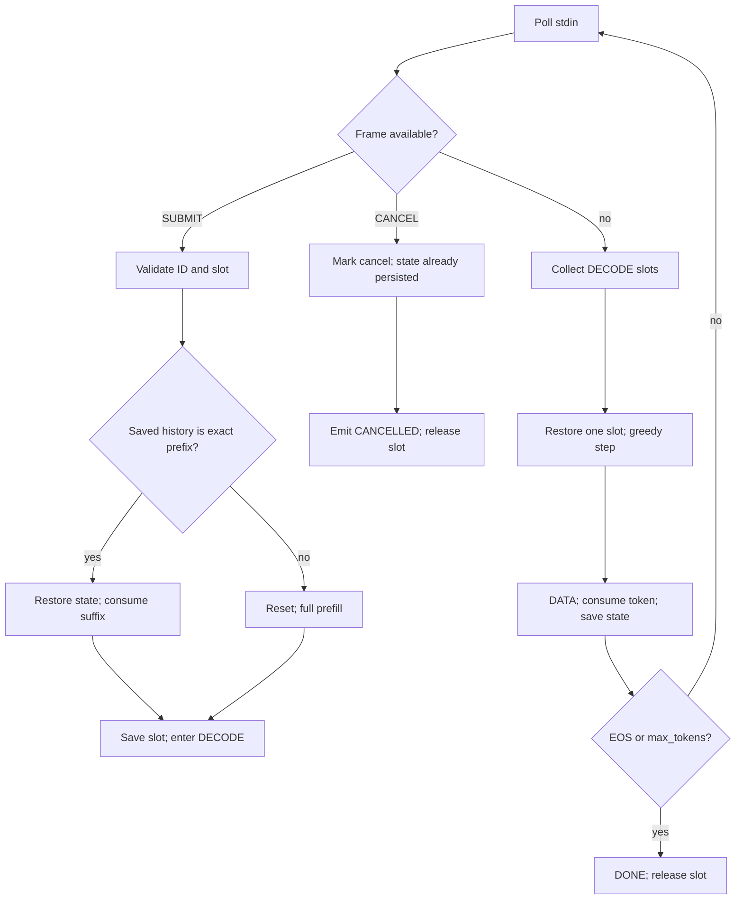

# Phase 9 Preflight 6: Functional Mux Engine

**Project:** colib
**Entry:** `SERVE_BATCH=1 MTP=0`
**Report date:** 25 July 2026
**Status:** protocol/session reference works; continuous kernels pending

## Abstract

The earlier Phase-9 preflights tested framing, scheduling, and model state in
isolation. This experiment connects them to the C engine. The mux loop now
accepts byte-framed prompts, tokenizes and prefills them, saves target state per
slot, streams byte-counted token pieces, polls for cancellation between decode
rounds, and emits terminal statistics. A released slot retains its history and
state for exact-prefix reuse by a later request; mismatched prompts receive a
fresh prefill.

Three subprocess integration tests pass on the tiny int4 model. One request
streams three `DATA` frames followed by `DONE`. A second test queues
`SUBMIT 7`, `CANCEL 7`, and `SUBMIT 8` for the same slot: request 7 emits
`CANCELLED` with no token data, and request 8 completes after safe slot reuse.
The third keeps slots 0 and 1 active together and verifies two token frames
plus a terminal response under each independent request ID.

Active rows currently restore and evaluate one at a time. This proves protocol
semantics but is not continuous model batching.

## 1. Runtime flow

Queued frames are drained before the next decode round, which allows a cancel
already present in the pipe to prevent generation.

## 2. Correctness restrictions

The reference loop currently requires:

- MTP disabled, because version-1 session state is target-only;
- greedy sampling (`temperature=0`, `top_p=1`);
- 1–16 configured slots;
- prompts that tokenize to at least one ID within context.

Unsupported sampling parameters fail as `BAD_REQUEST` rather than being
silently approximated.

## 3. State and prefix behavior

Each runtime slot owns:

- validated `SessionState`;
- consumed token IDs;
- request start time;
- a persistent validity flag independent of scheduler occupancy.

On `SUBMIT`, the complete rendered prompt is tokenized. If the stored IDs are
an exact prefix, the engine restores their boundary and consumes only the
suffix. Otherwise it resets and prefills the complete prompt. Generated tokens
are consumed and appended before the state is saved, so a later rendered chat
can extend the prior assistant output.

## 4. Integration tests

The tests execute the real `qwen` binary and parse stdout as bytes rather than
lines, ensuring newline-containing `DATA` payloads remain frame-safe.

| Test | Expected result |
|---|---|
| request 42, `max_tokens=3` | three `DATA 42` frames, then `DONE 42 STAT 3` |
| submit 7, cancel 7, submit 8 on slot 0 | `ERROR 7 CANCELLED`, no data for 7, terminal `DONE 8` |
| requests 21 and 22 on slots 0 and 1 | two data frames and one `DONE` for each ID |

Both complete with process exit code zero after stdin EOF.

## 5. Limitations and next step

Sequential save/restore copies recurrent and KV state for every active row and
is unsuitable for 397B throughput. It exists as a semantic oracle for the
batched implementation. The next step is to allocate model state per slot,
gather active slot pointers into the GDN/GQA kernels, and run shared dense
weights once per decode batch. The same integration tests must then pass
unchanged, followed by simultaneous two-slot token streams and mid-generation
cancellation.
